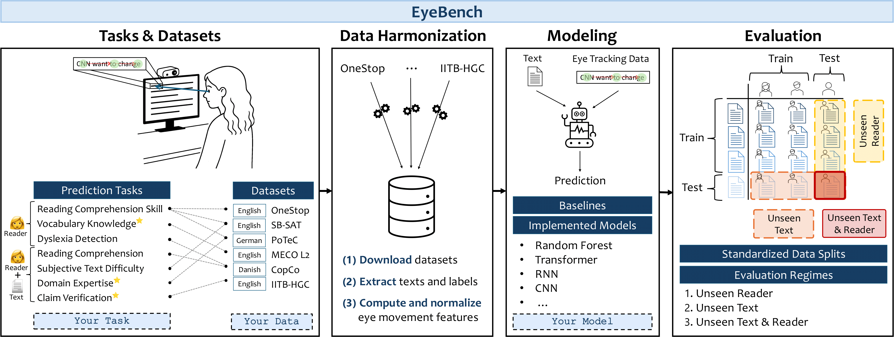

# EyeBench: Predictive Modeling from Eye Movements in Reading

[](https://www.python.org)
[](https://github.com/EyeBench/eyebench/actions/workflows/ruff.yml)

---

*Figure 1: Overview of EyeBench v1.0. The benchmark curates multiple datasets for predicting reader properties (👩), and reader–text interactions (👩+📝) from eye movements. * marks prediction tasks newly introduced in EyeBench. The data are preprocessed and standardized into aligned text and gaze sequences, which are then used as input to models trained to predict task-specific targets. The models are systematically evaluated under three generalization regimes — unseen readers, unseen texts, or both. The benchmark supports the evaluation and addition of new models, datasets, and tasks.*

---

## 🧠 Introduction

**EyeBench** is the first benchmark designed to evaluate machine learning models that decode cognitive and linguistic information from eye movements during reading.  
It provides a standardized, extensible framework for **predictive modeling from eye tracking data**, aiming to bridge **cognitive science and multimodal AI**.

EyeBench curates multiple publicly available datasets and tasks, covering both **reader properties** and **reader–text interactions**, and includes **baselines**, **state-of-the-art models**, and **evaluation protocols** that ensure reproducibility and comparability across studies.

Progress on EyeBench is expected to advance both **scientific understanding of human language processing** and **practical applications** such as adaptive educational systems and cognitive-aware user interfaces.

Official repository: [https://github.com/EyeBench/eyebench](https://github.com/EyeBench/eyebench)

---

## 📚 Tasks and Datasets

EyeBench v1.0 includes **seven prediction tasks** spanning **six harmonized datasets**.  
Each task is formulated as a **single-trial prediction problem** from a reader’s eye movements while reading a passage (and optionally an auxiliary text, such as a question or claim).

### Reader Properties (👤)

| Task | Dataset | Type | Target |
|------|----------|------|--------|
| **Reading Comprehension Skill** | CopCo | Regression | Continuous comprehension score (1–10) |
| **Vocabulary Knowledge** | MECO L2 | Regression | LexTALE vocabulary test score (0–100) |
| **Dyslexia Detection** | CopCo | Classification | Clinically diagnosed dyslexia (✓/no) |

### Reader–Text Interactions (👤 + 📖)

| Task | Dataset(s) | Type | Target |
|------|-------------|------|--------|
| **Reading Comprehension** | OneStop, SB-SAT, PoTeC | Classification | Correct answer to a comprehension question |
| **Subjective Text Difficulty** | SB-SAT | Regression | Perceived difficulty rating (Likert) |
| **Domain Expertise** | PoTeC | Classification | High vs low domain expertise |
| **Claim Verification** | IITB-HGC | Classification | Correct claim verification judgment |

### Datasets Overview

| Dataset | Language | Group | #Participants | #Words | #Fixations | Tasks |
|----------|-----------|--------|----------------|----------|-------------|--------|
| OneStop (Ordinary Reading) | English | L1 | 180 | 19 427 | 1.1 M | Reading Comprehension |
| SB-SAT | English | L1/L2 | 95 | 2 622 | 263 k | Reading Comprehension, Subjective Text Difficulty |
| PoTeC | German | L1 | 75 | 1 895 | 404 k | Reading Comprehension, Domain Expertise |
| MECO L2 | English | L2 | 1 098 | 1 646 | 2.4 M | Vocabulary Knowledge |
| CopCo | Danish | L1/L2/L1-Dyslexia | 57 | 32 140 | 398 k | Reading Comprehension Skill, Dyslexia Detection |
| IITB-HGC | English | L1/L2 | 5 | 53 528 | 164 k | Claim Verification |

---

## 🧩 Implemented Models and Baselines

EyeBench provides **12 implemented models** and **6 baselines**, unified under a shared training and evaluation framework.

### Neural Models

- **AhnCNN** – CNN over fixation sequences (coordinates, durations, pupil size)  
- **AhnRNN** – RNN variant of AhnCNN  
- **BEyeLSTM** – LSTM combining sequential fixations and global gaze statistics  
- **PLM-AS** – LSTM processing fixation-ordered word embeddings  
- **PLM-AS-RM** – RNN integrating fixation-ordered embeddings with reading measures  
- **RoBERTEye-W** – Transformer integrating word embeddings and word-level gaze features  
- **RoBERTEye-F** – Fixation-level variant of RoBERTEye-W  
- **MAG-Eye** – Multimodal Adaptation Gate injecting gaze into transformer layers  
- **PostFusion-Eye** – Cross-attention fusion of RoBERTa embeddings and CNN fixation features  

### Traditional ML Models

- **Logistic / Linear Regression**  
- **Support Vector Machine (SVM / SVR)**  
- **Random Forest (Classifier / Regressor)**  

### Baselines

- **Random** and **Majority Class** (classification)  
- **Mean** and **Median** (regression)  
- **Reading Speed**  
- **Text-Only RoBERTa** (no gaze input)

---

## 🧮 Evaluation Protocol

EyeBench evaluates models under **three complementary generalization regimes**:

| Regime | Description | Typical Use Case |
|---------|-------------|------------------|
| **Unseen Reader** | Texts seen, readers unseen | New readers, known materials |
| **Unseen Text** | Readers seen, texts unseen | Personalized reading of new content |
| **Unseen Reader & Text** | Both unseen | Fully general setting |

### Metrics

- **Classification:** AUROC, Balanced Accuracy  
- **Regression:** RMSE, MAE, R²  
- **Aggregate:** Average Normalized Score and Mean Rank across all task–dataset pairs.

---

## EyeBench Metric Dashboards

Interactive tables sourced from the latest formatted benchmark exports. Values show the mean and standard deviation across folds.

<!-- DataTables assets injected by gen_metric_tables.py -->
<link rel='stylesheet' href='https://cdn.datatables.net/1.13.6/css/jquery.dataTables.min.css'>
<style>
    /* Custom styling for DataTables in Material theme */
    .eyebench-datatable {
        width: 100% !important;
        margin: 1em 0 !important;
        border-collapse: collapse !important;
        font-size: 0.9em !important;
    }
    .eyebench-datatable thead {
        background-color: #ffffffff !important;
        color: white !important;
    }
    .eyebench-datatable thead th {
        padding: 12px 8px !important;
        text-align: left !important;
        font-weight: 600 !important;
        border-bottom: 2px solid #3f51b5 !important;
        color: black !important;
    }
    .eyebenb-datatable tbody tr {
        border-bottom: 1px solid #ddd !important;
    }
    .eyebench-datatable tbody tr:hover {
        background-color: #f5f5f5 !important;
    }
    .eyebench-datatable tbody td {
        padding: 10px 8px !important;
    }
    .eyebench-datatable tbody tr:nth-child(even) {
        background-color: #fafafa !important;
    }
    /* DataTables filter/search styling */
    .dataTables_wrapper .dataTables_filter {
        float: right !important;
        text-align: right !important;
        margin-bottom: 1em !important;
    }
    .dataTables_wrapper .dataTables_filter input {
        margin-left: 0.5em !important;
        padding: 5px 10px !important;
        border: 1px solid #ddd !important;
        border-radius: 4px !important;
    }
    /* Override Material theme table styles */
    .md-typeset table:not([class]) {
        display: table !important;
    }
    .dataTables_wrapper {
        margin: 2em 0 !important;
    }
</style>
<script src='https://code.jquery.com/jquery-3.7.0.min.js'></script>
<script src='https://cdn.datatables.net/1.13.6/js/jquery.dataTables.min.js'></script>
<script>
(function(){
    function initialiseTables(){
        if (!window.jQuery || !window.jQuery.fn || !window.jQuery.fn.DataTable){
            setTimeout(initialiseTables, 100);
            return;
        }
        document.querySelectorAll('table[data-datatable="true"]').forEach(function(tbl){
            if (!window.jQuery.fn.dataTable.isDataTable(tbl)){
                window.jQuery(tbl).DataTable({
                    paging: true,
                    pageLength: 25,
                    lengthChange: false,
                    info: true,
                    searching: true,
                    order: [],
                    autoWidth: false,
                    language: {
                        search: "Filter models:",
                        info: "Showing _START_ to _END_ of _TOTAL_ models",
                        infoEmpty: "No models found",
                        infoFiltered: "(filtered from _MAX_ total)",
                        paginate: {
                            first: "First",
                            last: "Last",
                            next: "Next",
                            previous: "Previous"
                        }
                    }
                });
            }
        });
    }
    if (document.readyState === 'loading'){
        document.addEventListener('DOMContentLoaded', function(){
            setTimeout(initialiseTables, 100);
        });
    } else {
        setTimeout(initialiseTables, 100);
    }
})();
</script>

## Overall Leaderboard (Test)

*Macro-level comparison across every benchmark task on the held-out test folds.*

<table id='aggregated_results_test_all_metrics-all' class='display compact stripe eyebench-datatable' data-datatable='true'><thead><tr><th>Model</th><th>Layout</th><th>Saccade/Fixation</th><th>Word-Level</th><th>Trial-Level</th><th>Linguistic</th><th>Embeddings</th><th>Avg Normalized Score</th><th>Mean Rank</th></tr></thead><tbody><tr><td>Majority Class / Chance</td><td>-</td><td>-</td><td>-</td><td>-</td><td>-</td><td>-</td><td>0.367</td><td>10.1</td></tr><tr><td>Reading Speed</td><td>-</td><td>-</td><td>-</td><td>✓</td><td>-</td><td>-</td><td>0.421</td><td>10.29</td></tr><tr><td>Text-Only Roberta</td><td>-</td><td>-</td><td>-</td><td>-</td><td>-</td><td>✓</td><td>0.672</td><td>6.1</td></tr><tr><td>Logistic Regression [meziere2023using]</td><td>-</td><td>-</td><td>-</td><td>✓</td><td>-</td><td>-</td><td>0.571</td><td>7.67</td></tr><tr><td>SVM [hollenstein2023zuco]</td><td>-</td><td>-</td><td>-</td><td>✓</td><td>-</td><td>-</td><td>0.521</td><td>7.38</td></tr><tr><td>Random Forest [makowski2024detection]</td><td>-</td><td>✓</td><td>-</td><td>✓</td><td>✓</td><td>-</td><td>0.788</td><td>4.48</td></tr><tr><td>AhnRNN [ahn2020towards]</td><td>✓</td><td>✓</td><td>-</td><td>-</td><td>-</td><td>-</td><td>0.36</td><td>9.48</td></tr><tr><td>AhnCNN [ahn2020towards]</td><td>✓</td><td>✓</td><td>-</td><td>-</td><td>-</td><td>-</td><td>0.531</td><td>6.95</td></tr><tr><td>BEyeLSTM [reich_inferring_2022]</td><td>✓</td><td>✓</td><td>✓</td><td>✓</td><td>✓</td><td>-</td><td>0.414</td><td>9.1</td></tr><tr><td>PLM-AS [Yang2023PLMASPL]</td><td>-</td><td>✓</td><td>-</td><td>-</td><td>-</td><td>✓</td><td>0.494</td><td>8.0</td></tr><tr><td>PLM-AS-RM [haller2022eye]</td><td>-</td><td>✓</td><td>✓</td><td>-</td><td>-</td><td>✓</td><td>0.475</td><td>8.95</td></tr><tr><td>RoBERTEye-W [Shubi2024Finegrained]</td><td>✓</td><td>-</td><td>✓</td><td>✓</td><td>✓</td><td>✓</td><td>0.757</td><td>4.43</td></tr><tr><td>RoBERTEye-F [Shubi2024Finegrained]</td><td>✓</td><td>✓</td><td>✓</td><td>✓</td><td>✓</td><td>✓</td><td>0.654</td><td>6.81</td></tr><tr><td>MAG-Eye [Shubi2024Finegrained]</td><td>✓</td><td>-</td><td>✓</td><td>✓</td><td>✓</td><td>✓</td><td>0.686</td><td>5.62</td></tr><tr><td>PostFusion-Eye [Shubi2024Finegrained]</td><td>✓</td><td>✓</td><td>✓</td><td>✓</td><td>✓</td><td>✓</td><td>0.546</td><td>9.81</td></tr></tbody></table>


## Results Tasks Combined

*Side-by-side view of the primary metric for each EyeBench task, averaged over folds.*

<table id='results_tasks_combined-all' class='display compact stripe eyebench-datatable' data-datatable='true'><thead><tr><th>Model</th><th>Onestop Rc</th><th>Sbsat Rc</th><th>Potec Rc</th><th>Potec De</th><th>Iitbhgc Cv</th><th>Copco Typ</th><th>Sbsat Std</th><th>Copco Rcs</th><th>Mecol2 Lex</th></tr></thead><tbody><tr><td>Majority Class / Chance</td><td>50.0 +/- 0.0</td><td>50.0 +/- 0.0</td><td>50.0 +/- 0.0</td><td>51.4 +/- 1.3</td><td>50.4 +/- 0.3</td><td>49.9 +/- 0.0</td><td>0.73 +/- 0.0</td><td>2.66 +/- 0.1</td><td>12.45 +/- 0.1</td></tr><tr><td>Reading Speed</td><td>49.6 +/- 0.8</td><td>50.8 +/- 1.6</td><td>51.9 +/- 2.2</td><td>60.4 +/- 1.7</td><td>57.3 +/- 0.7</td><td>56.6 +/- 2.1</td><td>0.77 +/- 0.0</td><td>2.68 +/- 0.1</td><td>28.95 +/- 14.3</td></tr><tr><td>Text-Only Roberta</td><td>61.1 +/- 1.0</td><td>55.9 +/- 2.3</td><td>56.3 +/- 1.6</td><td>62.0 +/- 4.0</td><td>58.8 +/- 1.5</td><td>50.1 +/- 0.4</td><td>0.72 +/- 0.0</td><td>2.64 +/- 0.0</td><td>12.45 +/- 0.1</td></tr><tr><td>Logistic Regression [meziere2023using]</td><td>53.0 +/- 0.8</td><td>52.3 +/- 1.0</td><td>54.1 +/- 0.7</td><td>54.0 +/- 1.7</td><td>54.6 +/- 1.1</td><td>80.6 +/- 2.3</td><td>0.82 +/- 0.0</td><td>2.74 +/- 0.1</td><td>10.34 +/- 0.0</td></tr><tr><td>SVM [hollenstein2023zuco]</td><td>50.7 +/- 0.7</td><td>50.2 +/- 0.9</td><td>50.6 +/- 0.7</td><td>54.5 +/- 1.5</td><td>54.5 +/- 0.6</td><td>72.5 +/- 1.6</td><td>0.73 +/- 0.0</td><td>2.76 +/- 0.1</td><td>10.94 +/- 0.0</td></tr><tr><td>Random Forest [makowski2024detection]</td><td>58.0 +/- 0.6</td><td>52.3 +/- 0.7</td><td>54.3 +/- 1.2</td><td>62.3 +/- 3.4</td><td>56.4 +/- 0.3</td><td>82.9 +/- 1.5</td><td>0.77 +/- 0.0</td><td>2.51 +/- 0.1</td><td>10.09 +/- 0.0</td></tr><tr><td>AhnRNN [ahn2020towards]</td><td>50.0 +/- 0.0</td><td>50.0 +/- 0.0</td><td>50.0 +/- 0.0</td><td>50.0 +/- 0.1</td><td>50.9 +/- 0.7</td><td>50.0 +/- 0.1</td><td>0.72 +/- 0.0</td><td>2.63 +/- 0.0</td><td>12.46 +/- 0.1</td></tr><tr><td>AhnCNN [ahn2020towards]</td><td>49.7 +/- 0.7</td><td>50.8 +/- 1.8</td><td>51.6 +/- 2.0</td><td>60.6 +/- 3.4</td><td>52.9 +/- 1.0</td><td>83.4 +/- 1.1</td><td>0.72 +/- 0.0</td><td>2.63 +/- 0.0</td><td>12.27 +/- 0.0</td></tr><tr><td>BEyeLSTM [reich_inferring_2022]</td><td>52.5 +/- 0.8</td><td>50.1 +/- 0.5</td><td>54.7 +/- 1.4</td><td>51.8 +/- 3.5</td><td>51.3 +/- 1.2</td><td>80.2 +/- 1.5</td><td>1.43 +/- 0.7</td><td>2.63 +/- 0.0</td><td>12.68 +/- 0.3</td></tr><tr><td>PLM-AS [Yang2023PLMASPL]</td><td>56.1 +/- 0.9</td><td>49.5 +/- 1.1</td><td>56.5 +/- 0.3</td><td>51.3 +/- 2.4</td><td>51.4 +/- 0.6</td><td>57.9 +/- 4.6</td><td>0.71 +/- 0.0</td><td>2.64 +/- 0.0</td><td>12.46 +/- 0.1</td></tr><tr><td>PLM-AS-RM [haller2022eye]</td><td>58.4 +/- 0.5</td><td>53.9 +/- 1.1</td><td>59.0 +/- 1.2</td><td>64.2 +/- 4.0</td><td>53.4 +/- 1.5</td><td>69.2 +/- 1.0</td><td>1.21 +/- 0.0</td><td>2.67 +/- 0.0</td><td>31.79 +/- 0.2</td></tr><tr><td>RoBERTEye-W [Shubi2024Finegrained]</td><td>61.4 +/- 0.9</td><td>57.4 +/- 3.7</td><td>56.8 +/- 1.2</td><td>62.5 +/- 7.3</td><td>58.0 +/- 2.2</td><td>75.6 +/- 2.3</td><td>0.71 +/- 0.0</td><td>2.65 +/- 0.0</td><td>11.16 +/- 0.1</td></tr><tr><td>RoBERTEye-F [Shubi2024Finegrained]</td><td>61.9 +/- 0.8</td><td>56.0 +/- 2.7</td><td>54.7 +/- 2.2</td><td>64.5 +/- 3.1</td><td>58.4 +/- 1.1</td><td>70.8 +/- 1.9</td><td>0.73 +/- 0.0</td><td>2.66 +/- 0.1</td><td>11.25 +/- 0.2</td></tr><tr><td>MAG-Eye [Shubi2024Finegrained]</td><td>62.9 +/- 0.5</td><td>56.0 +/- 2.1</td><td>58.3 +/- 1.3</td><td>57.6 +/- 7.1</td><td>58.0 +/- 2.0</td><td>53.3 +/- 3.7</td><td>0.72 +/- 0.0</td><td>2.64 +/- 0.0</td><td>12.46 +/- 0.1</td></tr><tr><td>PostFusion-Eye [Shubi2024Finegrained]</td><td>61.1 +/- 0.6</td><td>55.4 +/- 2.6</td><td>53.0 +/- 1.8</td><td>53.6 +/- 0.9</td><td>57.5 +/- 1.4</td><td>73.2 +/- 1.5</td><td>0.8 +/- 0.1</td><td>2.79 +/- 0.1</td><td>14.0 +/- 0.4</td></tr></tbody></table>


## Copco Rcs Test

*Source file: `CopCo_RCS_test.csv`*

<table id='copco_rcs_test-all' class='display compact stripe eyebench-datatable' data-datatable='true'><thead><tr><th>Model</th><th>Unseen Reader Rmse</th><th>Unseen Text Rmse</th><th>Unseen Text \& Reader Rmse</th><th>Average Rmse</th><th>Unseen Reader Mae</th><th>Unseen Text Mae</th><th>Unseen Text \& Reader Mae</th><th>Average Mae</th><th>Unseen Reader R²</th><th>Unseen Text R²</th><th>Unseen Text \& Reader R²</th><th>Average R²</th></tr></thead><tbody><tr><td>Majority Class / Chance</td><td>2.66 +/- 0.1</td><td>2.67 +/- 0.0</td><td>2.56 +/- 0.0</td><td>2.66 +/- 0.1</td><td>2.19 +/- 0.1</td><td>2.2 +/- 0.0</td><td>2.13 +/- 0.1</td><td>2.18 +/- 0.0</td><td>-0.05 +/- 0.0</td><td>-0.05 +/- 0.0</td><td>-0.09 +/- 0.0</td><td>-0.03 +/- 0.0</td></tr><tr><td>Reading Speed</td><td>2.69 +/- 0.1</td><td>2.68 +/- 0.1</td><td>2.6 +/- 0.0</td><td>2.68 +/- 0.1</td><td>2.21 +/- 0.1</td><td>2.24 +/- 0.0</td><td>2.18 +/- 0.1</td><td>2.22 +/- 0.0</td><td>-0.07 +/- 0.0</td><td>-0.06 +/- 0.0</td><td>-0.12 +/- 0.0</td><td>-0.05 +/- 0.0</td></tr><tr><td>Text-Only Roberta</td><td>2.65 +/- 0.1</td><td>2.63 +/- 0.0</td><td>2.61 +/- 0.1</td><td>2.64 +/- 0.0</td><td>2.22 +/- 0.1</td><td>2.19 +/- 0.1</td><td>2.23 +/- 0.1</td><td>2.21 +/- 0.1</td><td>-0.04 +/- 0.0</td><td>-0.01 +/- 0.0</td><td>-0.13 +/- 0.1</td><td>-0.02 +/- 0.0</td></tr><tr><td>Logistic Regression [meziere2023using]</td><td>2.74 +/- 0.1</td><td>2.75 +/- 0.0</td><td>2.7 +/- 0.0</td><td>2.74 +/- 0.1</td><td>2.26 +/- 0.1</td><td>2.3 +/- 0.0</td><td>2.3 +/- 0.1</td><td>2.28 +/- 0.0</td><td>-0.11 +/- 0.0</td><td>-0.12 +/- 0.0</td><td>-0.21 +/- 0.0</td><td>-0.1 +/- 0.0</td></tr><tr><td>SVM [hollenstein2023zuco]</td><td>2.89 +/- 0.1</td><td>2.63 +/- 0.1</td><td>2.74 +/- 0.1</td><td>2.76 +/- 0.1</td><td>2.28 +/- 0.0</td><td>2.1 +/- 0.1</td><td>2.17 +/- 0.1</td><td>2.18 +/- 0.0</td><td>-0.28 +/- 0.2</td><td>-0.03 +/- 0.1</td><td>-0.27 +/- 0.1</td><td>-0.12 +/- 0.1</td></tr><tr><td>Random Forest [makowski2024detection]</td><td>2.76 +/- 0.1</td><td>2.22 +/- 0.1</td><td>2.54 +/- 0.1</td><td>2.51 +/- 0.1</td><td>2.2 +/- 0.1</td><td>1.75 +/- 0.0</td><td>2.08 +/- 0.1</td><td>1.99 +/- 0.1</td><td>-0.14 +/- 0.1</td><td>0.27 +/- 0.1</td><td>-0.07 +/- 0.1</td><td>0.08 +/- 0.0</td></tr><tr><td>AhnRNN [ahn2020towards]</td><td>2.64 +/- 0.1</td><td>2.62 +/- 0.0</td><td>2.58 +/- 0.1</td><td>2.63 +/- 0.0</td><td>2.21 +/- 0.1</td><td>2.19 +/- 0.0</td><td>2.19 +/- 0.1</td><td>2.2 +/- 0.0</td><td>-0.03 +/- 0.0</td><td>-0.0 +/- 0.0</td><td>-0.1 +/- 0.1</td><td>-0.01 +/- 0.0</td></tr><tr><td>AhnCNN [ahn2020towards]</td><td>2.64 +/- 0.1</td><td>2.61 +/- 0.0</td><td>2.58 +/- 0.1</td><td>2.63 +/- 0.0</td><td>2.22 +/- 0.1</td><td>2.19 +/- 0.0</td><td>2.19 +/- 0.1</td><td>2.2 +/- 0.0</td><td>-0.03 +/- 0.0</td><td>-0.0 +/- 0.0</td><td>-0.11 +/- 0.1</td><td>-0.01 +/- 0.0</td></tr><tr><td>BEyeLSTM [reich_inferring_2022]</td><td>2.64 +/- 0.1</td><td>2.62 +/- 0.0</td><td>2.59 +/- 0.1</td><td>2.63 +/- 0.0</td><td>2.22 +/- 0.1</td><td>2.19 +/- 0.0</td><td>2.19 +/- 0.1</td><td>2.21 +/- 0.0</td><td>-0.04 +/- 0.0</td><td>-0.01 +/- 0.0</td><td>-0.11 +/- 0.1</td><td>-0.01 +/- 0.0</td></tr><tr><td>PLM-AS [Yang2023PLMASPL]</td><td>2.66 +/- 0.1</td><td>2.62 +/- 0.0</td><td>2.6 +/- 0.1</td><td>2.64 +/- 0.0</td><td>2.21 +/- 0.1</td><td>2.19 +/- 0.1</td><td>2.19 +/- 0.1</td><td>2.2 +/- 0.0</td><td>-0.05 +/- 0.0</td><td>-0.01 +/- 0.0</td><td>-0.12 +/- 0.1</td><td>-0.02 +/- 0.0</td></tr><tr><td>PLM-AS-RM [haller2022eye]</td><td>2.69 +/- 0.1</td><td>2.65 +/- 0.0</td><td>2.6 +/- 0.1</td><td>2.67 +/- 0.0</td><td>2.23 +/- 0.1</td><td>2.23 +/- 0.0</td><td>2.19 +/- 0.1</td><td>2.23 +/- 0.1</td><td>-0.07 +/- 0.0</td><td>-0.03 +/- 0.0</td><td>-0.12 +/- 0.0</td><td>-0.04 +/- 0.0</td></tr><tr><td>RoBERTEye-W [Shubi2024Finegrained]</td><td>2.67 +/- 0.1</td><td>2.63 +/- 0.0</td><td>2.6 +/- 0.1</td><td>2.65 +/- 0.0</td><td>2.24 +/- 0.1</td><td>2.2 +/- 0.0</td><td>2.2 +/- 0.1</td><td>2.22 +/- 0.0</td><td>-0.06 +/- 0.0</td><td>-0.02 +/- 0.0</td><td>-0.12 +/- 0.0</td><td>-0.03 +/- 0.0</td></tr><tr><td>RoBERTEye-F [Shubi2024Finegrained]</td><td>2.67 +/- 0.1</td><td>2.64 +/- 0.1</td><td>2.65 +/- 0.1</td><td>2.66 +/- 0.1</td><td>2.24 +/- 0.1</td><td>2.2 +/- 0.1</td><td>2.25 +/- 0.1</td><td>2.23 +/- 0.1</td><td>-0.06 +/- 0.0</td><td>-0.02 +/- 0.0</td><td>-0.16 +/- 0.1</td><td>-0.04 +/- 0.0</td></tr><tr><td>MAG-Eye [Shubi2024Finegrained]</td><td>2.65 +/- 0.1</td><td>2.63 +/- 0.0</td><td>2.59 +/- 0.1</td><td>2.64 +/- 0.0</td><td>2.22 +/- 0.1</td><td>2.2 +/- 0.1</td><td>2.21 +/- 0.1</td><td>2.21 +/- 0.0</td><td>-0.04 +/- 0.0</td><td>-0.01 +/- 0.0</td><td>-0.11 +/- 0.1</td><td>-0.02 +/- 0.0</td></tr><tr><td>PostFusion-Eye [Shubi2024Finegrained]</td><td>2.9 +/- 0.1</td><td>2.67 +/- 0.1</td><td>2.77 +/- 0.1</td><td>2.79 +/- 0.1</td><td>2.4 +/- 0.1</td><td>2.23 +/- 0.1</td><td>2.37 +/- 0.1</td><td>2.33 +/- 0.1</td><td>-0.25 +/- 0.1</td><td>-0.05 +/- 0.0</td><td>-0.27 +/- 0.0</td><td>-0.14 +/- 0.0</td></tr></tbody></table>


## Copco Rcs Val

*Source file: `CopCo_RCS_val.csv`*

<table id='copco_rcs_val-all' class='display compact stripe eyebench-datatable' data-datatable='true'><thead><tr><th>Model</th><th>Unseen Reader Rmse</th><th>Unseen Text Rmse</th><th>Unseen Text \& Reader Rmse</th><th>Average Rmse</th><th>Unseen Reader Mae</th><th>Unseen Text Mae</th><th>Unseen Text \& Reader Mae</th><th>Average Mae</th><th>Unseen Reader R²</th><th>Unseen Text R²</th><th>Unseen Text \& Reader R²</th><th>Average R²</th></tr></thead><tbody><tr><td>Majority Class / Chance</td><td>2.82 +/- 0.1</td><td>2.48 +/- 0.0</td><td>2.58 +/- 0.1</td><td>2.65 +/- 0.0</td><td>2.36 +/- 0.1</td><td>1.98 +/- 0.0</td><td>2.11 +/- 0.1</td><td>2.17 +/- 0.1</td><td>-0.06 +/- 0.0</td><td>-0.08 +/- 0.1</td><td>-0.1 +/- 0.0</td><td>-0.03 +/- 0.0</td></tr><tr><td>Reading Speed</td><td>2.82 +/- 0.1</td><td>2.44 +/- 0.0</td><td>2.62 +/- 0.1</td><td>2.66 +/- 0.0</td><td>2.38 +/- 0.1</td><td>1.95 +/- 0.1</td><td>2.17 +/- 0.1</td><td>2.19 +/- 0.1</td><td>-0.07 +/- 0.0</td><td>-0.04 +/- 0.0</td><td>-0.14 +/- 0.1</td><td>-0.03 +/- 0.0</td></tr><tr><td>Text-Only Roberta</td><td>2.77 +/- 0.1</td><td>2.46 +/- 0.1</td><td>2.55 +/- 0.1</td><td>2.62 +/- 0.1</td><td>2.38 +/- 0.1</td><td>1.99 +/- 0.0</td><td>2.17 +/- 0.1</td><td>2.2 +/- 0.0</td><td>-0.02 +/- 0.0</td><td>-0.05 +/- 0.0</td><td>-0.07 +/- 0.0</td><td>-0.0 +/- 0.0</td></tr><tr><td>Logistic Regression [meziere2023using]</td><td>3.02 +/- 0.1</td><td>2.49 +/- 0.0</td><td>2.71 +/- 0.1</td><td>2.78 +/- 0.1</td><td>2.58 +/- 0.1</td><td>1.98 +/- 0.0</td><td>2.3 +/- 0.1</td><td>2.3 +/- 0.0</td><td>-0.23 +/- 0.1</td><td>-0.08 +/- 0.1</td><td>-0.22 +/- 0.1</td><td>-0.13 +/- 0.1</td></tr><tr><td>SVM [hollenstein2023zuco]</td><td>2.97 +/- 0.1</td><td>2.31 +/- 0.1</td><td>2.63 +/- 0.1</td><td>2.68 +/- 0.1</td><td>2.47 +/- 0.1</td><td>1.71 +/- 0.0</td><td>2.1 +/- 0.1</td><td>2.12 +/- 0.1</td><td>-0.19 +/- 0.1</td><td>0.05 +/- 0.1</td><td>-0.15 +/- 0.1</td><td>-0.05 +/- 0.0</td></tr><tr><td>Random Forest [makowski2024detection]</td><td>2.86 +/- 0.1</td><td>1.82 +/- 0.1</td><td>2.78 +/- 0.2</td><td>2.52 +/- 0.1</td><td>2.34 +/- 0.1</td><td>1.38 +/- 0.1</td><td>2.25 +/- 0.2</td><td>1.97 +/- 0.1</td><td>-0.1 +/- 0.0</td><td>0.41 +/- 0.1</td><td>-0.29 +/- 0.1</td><td>0.07 +/- 0.0</td></tr><tr><td>AhnRNN [ahn2020towards]</td><td>2.76 +/- 0.1</td><td>2.46 +/- 0.1</td><td>2.55 +/- 0.1</td><td>2.62 +/- 0.1</td><td>2.37 +/- 0.1</td><td>2.01 +/- 0.1</td><td>2.16 +/- 0.1</td><td>2.2 +/- 0.0</td><td>-0.01 +/- 0.0</td><td>-0.05 +/- 0.0</td><td>-0.08 +/- 0.0</td><td>-0.0 +/- 0.0</td></tr><tr><td>AhnCNN [ahn2020towards]</td><td>2.76 +/- 0.1</td><td>2.46 +/- 0.1</td><td>2.55 +/- 0.1</td><td>2.62 +/- 0.1</td><td>2.38 +/- 0.1</td><td>2.0 +/- 0.1</td><td>2.16 +/- 0.1</td><td>2.2 +/- 0.0</td><td>-0.01 +/- 0.0</td><td>-0.05 +/- 0.0</td><td>-0.07 +/- 0.0</td><td>0.0 +/- 0.0</td></tr><tr><td>BEyeLSTM [reich_inferring_2022]</td><td>2.76 +/- 0.1</td><td>2.45 +/- 0.1</td><td>2.56 +/- 0.1</td><td>2.62 +/- 0.1</td><td>2.38 +/- 0.1</td><td>2.0 +/- 0.1</td><td>2.17 +/- 0.1</td><td>2.2 +/- 0.1</td><td>-0.01 +/- 0.0</td><td>-0.05 +/- 0.0</td><td>-0.08 +/- 0.1</td><td>-0.0 +/- 0.0</td></tr><tr><td>PLM-AS [Yang2023PLMASPL]</td><td>2.76 +/- 0.1</td><td>2.46 +/- 0.1</td><td>2.54 +/- 0.1</td><td>2.62 +/- 0.1</td><td>2.37 +/- 0.1</td><td>2.0 +/- 0.1</td><td>2.13 +/- 0.1</td><td>2.19 +/- 0.0</td><td>-0.02 +/- 0.0</td><td>-0.05 +/- 0.0</td><td>-0.07 +/- 0.0</td><td>-0.0 +/- 0.0</td></tr><tr><td>PLM-AS-RM [haller2022eye]</td><td>2.79 +/- 0.1</td><td>2.47 +/- 0.1</td><td>2.63 +/- 0.1</td><td>2.65 +/- 0.0</td><td>2.39 +/- 0.1</td><td>2.0 +/- 0.1</td><td>2.22 +/- 0.1</td><td>2.22 +/- 0.1</td><td>-0.04 +/- 0.0</td><td>-0.06 +/- 0.0</td><td>-0.15 +/- 0.1</td><td>-0.03 +/- 0.0</td></tr><tr><td>RoBERTEye-W [Shubi2024Finegrained]</td><td>2.77 +/- 0.1</td><td>2.44 +/- 0.0</td><td>2.55 +/- 0.1</td><td>2.61 +/- 0.1</td><td>2.37 +/- 0.1</td><td>1.98 +/- 0.0</td><td>2.15 +/- 0.1</td><td>2.18 +/- 0.0</td><td>-0.02 +/- 0.0</td><td>-0.04 +/- 0.0</td><td>-0.07 +/- 0.0</td><td>0.0 +/- 0.0</td></tr><tr><td>RoBERTEye-F [Shubi2024Finegrained]</td><td>2.77 +/- 0.1</td><td>2.45 +/- 0.0</td><td>2.54 +/- 0.1</td><td>2.62 +/- 0.1</td><td>2.4 +/- 0.1</td><td>1.98 +/- 0.0</td><td>2.15 +/- 0.1</td><td>2.2 +/- 0.0</td><td>-0.03 +/- 0.0</td><td>-0.05 +/- 0.0</td><td>-0.07 +/- 0.1</td><td>-0.0 +/- 0.0</td></tr><tr><td>MAG-Eye [Shubi2024Finegrained]</td><td>2.76 +/- 0.1</td><td>2.46 +/- 0.1</td><td>2.55 +/- 0.1</td><td>2.62 +/- 0.1</td><td>2.37 +/- 0.1</td><td>1.99 +/- 0.1</td><td>2.18 +/- 0.1</td><td>2.2 +/- 0.0</td><td>-0.01 +/- 0.0</td><td>-0.05 +/- 0.0</td><td>-0.08 +/- 0.0</td><td>0.0 +/- 0.0</td></tr><tr><td>PostFusion-Eye [Shubi2024Finegrained]</td><td>2.86 +/- 0.2</td><td>2.52 +/- 0.1</td><td>2.66 +/- 0.1</td><td>2.71 +/- 0.1</td><td>2.49 +/- 0.1</td><td>2.06 +/- 0.1</td><td>2.34 +/- 0.1</td><td>2.3 +/- 0.1</td><td>-0.08 +/- 0.0</td><td>-0.11 +/- 0.1</td><td>-0.17 +/- 0.1</td><td>-0.07 +/- 0.0</td></tr></tbody></table>


## Copco Typ Test

*Source file: `CopCo_TYP_test.csv`*

<table id='copco_typ_test-all' class='display compact stripe eyebench-datatable' data-datatable='true'><thead><tr><th>Model</th><th>Unseen Reader \Makecell{Balanced\\Accuracy}</th><th>Unseen Text \Makecell{Balanced\\Accuracy}</th><th>Unseen Text \& Reader \Makecell{Balanced\\Accuracy}</th><th>Average \Makecell{Balanced\\Accuracy}</th><th>Unseen Reader Auroc</th><th>Unseen Text Auroc</th><th>Unseen Text \& Reader Auroc</th><th>Average Auroc</th></tr></thead><tbody><tr><td>Majority Class / Chance</td><td>50.3 +/- 0.3</td><td>49.6 +/- 0.4</td><td>50.1 +/- 0.1</td><td>49.9 +/- 0.0</td><td>50.3 +/- 0.3</td><td>49.6 +/- 0.4</td><td>50.1 +/- 0.1</td><td>49.9 +/- 0.0</td></tr><tr><td>Reading Speed</td><td>57.7 +/- 2.2</td><td>54.9 +/- 1.8</td><td>50.6 +/- 2.7</td><td>55.1 +/- 2.1</td><td>60.7 +/- 2.0</td><td>56.2 +/- 2.0</td><td>50.9 +/- 4.8</td><td>56.6 +/- 2.1</td></tr><tr><td>Text-Only Roberta</td><td>50.0 +/- 0.0</td><td>50.0 +/- 0.0</td><td>50.0 +/- 0.0</td><td>50.0 +/- 0.0</td><td>47.0 +/- 4.4</td><td>50.0 +/- 0.2</td><td>50.4 +/- 1.1</td><td>50.1 +/- 0.4</td></tr><tr><td>Logistic Regression [meziere2023using]</td><td>75.5 +/- 3.1</td><td>76.6 +/- 1.6</td><td>63.5 +/- 5.1</td><td>73.8 +/- 2.1</td><td>83.1 +/- 3.1</td><td>83.3 +/- 1.6</td><td>68.9 +/- 6.6</td><td>80.6 +/- 2.3</td></tr><tr><td>SVM [hollenstein2023zuco]</td><td>70.7 +/- 2.4</td><td>77.4 +/- 1.7</td><td>64.7 +/- 3.1</td><td>72.5 +/- 1.6</td><td>70.7 +/- 2.4</td><td>77.4 +/- 1.7</td><td>64.7 +/- 3.1</td><td>72.5 +/- 1.6</td></tr><tr><td>Random Forest [makowski2024detection]</td><td>69.8 +/- 4.2</td><td>81.5 +/- 2.2</td><td>59.7 +/- 4.9</td><td>72.7 +/- 1.9</td><td>80.1 +/- 3.6</td><td>91.5 +/- 1.5</td><td>65.9 +/- 6.6</td><td>82.9 +/- 1.5</td></tr><tr><td>AhnRNN [ahn2020towards]</td><td>50.0 +/- 0.0</td><td>50.0 +/- 0.0</td><td>50.0 +/- 0.0</td><td>50.0 +/- 0.0</td><td>50.1 +/- 0.1</td><td>50.0 +/- 0.0</td><td>50.0 +/- 0.1</td><td>50.0 +/- 0.1</td></tr><tr><td>AhnCNN [ahn2020towards]</td><td>77.7 +/- 1.8</td><td>77.5 +/- 2.7</td><td>65.6 +/- 2.4</td><td>75.0 +/- 0.8</td><td>85.3 +/- 1.6</td><td>85.7 +/- 2.3</td><td>74.9 +/- 2.8</td><td>83.4 +/- 1.1</td></tr><tr><td>BEyeLSTM [reich_inferring_2022]</td><td>71.9 +/- 2.1</td><td>76.8 +/- 1.7</td><td>64.7 +/- 5.0</td><td>72.9 +/- 1.3</td><td>79.4 +/- 2.8</td><td>85.0 +/- 1.3</td><td>69.2 +/- 6.2</td><td>80.2 +/- 1.5</td></tr><tr><td>PLM-AS [Yang2023PLMASPL]</td><td>55.2 +/- 4.3</td><td>57.3 +/- 3.4</td><td>55.9 +/- 2.2</td><td>56.0 +/- 3.2</td><td>57.6 +/- 5.9</td><td>58.5 +/- 4.9</td><td>59.4 +/- 0.9</td><td>57.9 +/- 4.6</td></tr><tr><td>PLM-AS-RM [haller2022eye]</td><td>60.9 +/- 2.8</td><td>71.6 +/- 2.4</td><td>54.6 +/- 1.1</td><td>63.7 +/- 0.9</td><td>63.9 +/- 4.3</td><td>80.1 +/- 1.9</td><td>55.0 +/- 1.9</td><td>69.2 +/- 1.0</td></tr><tr><td>RoBERTEye-W [Shubi2024Finegrained]</td><td>70.0 +/- 4.0</td><td>68.5 +/- 3.0</td><td>61.9 +/- 4.6</td><td>67.4 +/- 2.9</td><td>78.3 +/- 3.2</td><td>76.7 +/- 2.9</td><td>68.2 +/- 5.3</td><td>75.6 +/- 2.3</td></tr><tr><td>RoBERTEye-F [Shubi2024Finegrained]</td><td>60.6 +/- 2.1</td><td>60.3 +/- 2.4</td><td>54.0 +/- 2.1</td><td>58.9 +/- 1.4</td><td>71.9 +/- 4.2</td><td>74.7 +/- 1.3</td><td>63.3 +/- 2.3</td><td>70.8 +/- 1.9</td></tr><tr><td>MAG-Eye [Shubi2024Finegrained]</td><td>47.2 +/- 2.4</td><td>49.7 +/- 0.2</td><td>51.4 +/- 1.2</td><td>50.3 +/- 0.3</td><td>45.9 +/- 7.5</td><td>54.7 +/- 4.1</td><td>56.1 +/- 1.0</td><td>53.3 +/- 3.7</td></tr><tr><td>PostFusion-Eye [Shubi2024Finegrained]</td><td>64.7 +/- 4.3</td><td>68.9 +/- 2.3</td><td>57.0 +/- 3.7</td><td>64.4 +/- 2.4</td><td>73.1 +/- 4.0</td><td>78.1 +/- 1.6</td><td>65.5 +/- 3.4</td><td>73.2 +/- 1.5</td></tr></tbody></table>


## Copco Typ Val

*Source file: `CopCo_TYP_val.csv`*

<table id='copco_typ_val-all' class='display compact stripe eyebench-datatable' data-datatable='true'><thead><tr><th>Model</th><th>Unseen Reader \Makecell{Balanced\\Accuracy}</th><th>Unseen Text \Makecell{Balanced\\Accuracy}</th><th>Unseen Text \& Reader \Makecell{Balanced\\Accuracy}</th><th>Average \Makecell{Balanced\\Accuracy}</th><th>Unseen Reader Auroc</th><th>Unseen Text Auroc</th><th>Unseen Text \& Reader Auroc</th><th>Average Auroc</th></tr></thead><tbody><tr><td>Majority Class / Chance</td><td>50.9 +/- 0.8</td><td>50.9 +/- 0.8</td><td>50.0 +/- 0.0</td><td>50.5 +/- 0.4</td><td>50.9 +/- 0.8</td><td>50.9 +/- 0.8</td><td>50.0 +/- 0.0</td><td>50.5 +/- 0.4</td></tr><tr><td>Reading Speed</td><td>57.9 +/- 4.1</td><td>55.1 +/- 2.2</td><td>52.1 +/- 2.1</td><td>55.1 +/- 2.5</td><td>60.4 +/- 4.5</td><td>57.7 +/- 4.6</td><td>50.9 +/- 4.8</td><td>56.3 +/- 2.6</td></tr><tr><td>Text-Only Roberta</td><td>50.0 +/- 0.0</td><td>50.0 +/- 0.0</td><td>50.0 +/- 0.0</td><td>50.0 +/- 0.0</td><td>53.5 +/- 2.5</td><td>51.6 +/- 1.1</td><td>49.4 +/- 0.5</td><td>52.4 +/- 1.7</td></tr><tr><td>Logistic Regression [meziere2023using]</td><td>72.1 +/- 2.9</td><td>79.2 +/- 3.3</td><td>64.1 +/- 3.3</td><td>72.4 +/- 1.5</td><td>78.3 +/- 2.4</td><td>85.3 +/- 3.5</td><td>69.7 +/- 5.6</td><td>78.7 +/- 2.0</td></tr><tr><td>SVM [hollenstein2023zuco]</td><td>72.8 +/- 2.2</td><td>83.2 +/- 2.6</td><td>67.0 +/- 3.1</td><td>74.8 +/- 1.0</td><td>72.8 +/- 2.2</td><td>83.2 +/- 2.6</td><td>67.0 +/- 3.1</td><td>74.8 +/- 1.0</td></tr><tr><td>Random Forest [makowski2024detection]</td><td>72.7 +/- 4.0</td><td>86.9 +/- 2.2</td><td>66.0 +/- 2.7</td><td>75.2 +/- 1.8</td><td>81.5 +/- 3.8</td><td>95.2 +/- 1.2</td><td>73.1 +/- 3.6</td><td>83.9 +/- 2.3</td></tr><tr><td>AhnRNN [ahn2020towards]</td><td>50.0 +/- 0.0</td><td>50.0 +/- 0.0</td><td>50.0 +/- 0.0</td><td>50.0 +/- 0.0</td><td>49.9 +/- 0.1</td><td>49.9 +/- 0.1</td><td>49.9 +/- 0.0</td><td>49.9 +/- 0.0</td></tr><tr><td>AhnCNN [ahn2020towards]</td><td>73.9 +/- 3.0</td><td>77.5 +/- 2.6</td><td>68.3 +/- 1.1</td><td>73.5 +/- 1.6</td><td>82.0 +/- 1.8</td><td>86.5 +/- 3.1</td><td>74.9 +/- 1.7</td><td>81.3 +/- 1.5</td></tr><tr><td>BEyeLSTM [reich_inferring_2022]</td><td>72.6 +/- 2.2</td><td>76.7 +/- 3.2</td><td>68.3 +/- 3.7</td><td>73.1 +/- 2.1</td><td>80.3 +/- 2.5</td><td>85.0 +/- 3.7</td><td>74.0 +/- 4.0</td><td>80.4 +/- 2.6</td></tr><tr><td>PLM-AS [Yang2023PLMASPL]</td><td>52.5 +/- 2.0</td><td>61.6 +/- 3.3</td><td>53.3 +/- 1.2</td><td>55.8 +/- 2.2</td><td>54.2 +/- 3.6</td><td>66.4 +/- 4.5</td><td>55.4 +/- 2.1</td><td>58.8 +/- 2.3</td></tr><tr><td>PLM-AS-RM [haller2022eye]</td><td>63.9 +/- 4.6</td><td>68.9 +/- 5.0</td><td>57.1 +/- 3.8</td><td>62.8 +/- 2.1</td><td>65.9 +/- 5.7</td><td>74.2 +/- 6.4</td><td>62.1 +/- 4.2</td><td>67.2 +/- 3.0</td></tr><tr><td>RoBERTEye-W [Shubi2024Finegrained]</td><td>62.4 +/- 3.3</td><td>69.8 +/- 3.8</td><td>59.6 +/- 2.4</td><td>63.5 +/- 1.7</td><td>71.2 +/- 3.2</td><td>77.6 +/- 4.2</td><td>67.5 +/- 3.2</td><td>71.6 +/- 1.8</td></tr><tr><td>RoBERTEye-F [Shubi2024Finegrained]</td><td>57.0 +/- 1.5</td><td>61.2 +/- 3.2</td><td>55.2 +/- 1.8</td><td>57.6 +/- 1.7</td><td>70.5 +/- 3.1</td><td>75.5 +/- 3.4</td><td>65.7 +/- 2.2</td><td>69.9 +/- 1.8</td></tr><tr><td>MAG-Eye [Shubi2024Finegrained]</td><td>51.2 +/- 1.0</td><td>52.8 +/- 2.5</td><td>49.8 +/- 0.2</td><td>51.7 +/- 1.5</td><td>60.5 +/- 1.9</td><td>62.0 +/- 5.9</td><td>59.4 +/- 4.0</td><td>60.6 +/- 4.0</td></tr><tr><td>PostFusion-Eye [Shubi2024Finegrained]</td><td>65.6 +/- 2.3</td><td>72.0 +/- 4.2</td><td>60.6 +/- 2.8</td><td>65.9 +/- 2.2</td><td>75.7 +/- 2.0</td><td>79.3 +/- 4.0</td><td>70.7 +/- 2.7</td><td>74.1 +/- 1.8</td></tr></tbody></table>


## Iitbhgc Cv Test

*Source file: `IITBHGC_CV_test.csv`*

<table id='iitbhgc_cv_test-all' class='display compact stripe eyebench-datatable' data-datatable='true'><thead><tr><th>Model</th><th>Unseen Reader \Makecell{Balanced\\Accuracy}</th><th>Unseen Text \Makecell{Balanced\\Accuracy}</th><th>Unseen Text \& Reader \Makecell{Balanced\\Accuracy}</th><th>Average \Makecell{Balanced\\Accuracy}</th><th>Unseen Reader Auroc</th><th>Unseen Text Auroc</th><th>Unseen Text \& Reader Auroc</th><th>Average Auroc</th></tr></thead><tbody><tr><td>Majority Class / Chance</td><td>49.5 +/- 0.4</td><td>51.0 +/- 0.9</td><td>50.6 +/- 0.6</td><td>50.4 +/- 0.3</td><td>49.5 +/- 0.4</td><td>51.0 +/- 0.9</td><td>50.6 +/- 0.6</td><td>50.4 +/- 0.3</td></tr><tr><td>Reading Speed</td><td>55.6 +/- 0.4</td><td>55.5 +/- 1.0</td><td>55.8 +/- 1.4</td><td>55.6 +/- 0.6</td><td>56.5 +/- 1.1</td><td>56.9 +/- 1.4</td><td>58.0 +/- 1.3</td><td>57.3 +/- 0.7</td></tr><tr><td>Text-Only Roberta</td><td>55.9 +/- 2.6</td><td>49.8 +/- 0.3</td><td>49.7 +/- 0.7</td><td>52.5 +/- 1.4</td><td>62.5 +/- 2.7</td><td>55.1 +/- 1.2</td><td>56.1 +/- 5.4</td><td>58.8 +/- 1.5</td></tr><tr><td>Logistic Regression [meziere2023using]</td><td>53.3 +/- 1.1</td><td>54.2 +/- 1.5</td><td>55.7 +/- 0.8</td><td>53.9 +/- 1.0</td><td>53.2 +/- 0.9</td><td>55.5 +/- 1.6</td><td>55.6 +/- 0.7</td><td>54.6 +/- 1.1</td></tr><tr><td>SVM [hollenstein2023zuco]</td><td>52.9 +/- 0.8</td><td>55.0 +/- 1.4</td><td>57.8 +/- 1.4</td><td>54.5 +/- 0.6</td><td>52.9 +/- 0.8</td><td>55.0 +/- 1.4</td><td>57.8 +/- 1.4</td><td>54.5 +/- 0.6</td></tr><tr><td>Random Forest [makowski2024detection]</td><td>56.0 +/- 1.6</td><td>52.2 +/- 0.5</td><td>51.6 +/- 2.1</td><td>53.4 +/- 0.6</td><td>59.6 +/- 0.8</td><td>54.0 +/- 0.4</td><td>55.7 +/- 1.4</td><td>56.4 +/- 0.3</td></tr><tr><td>AhnRNN [ahn2020towards]</td><td>50.0 +/- 0.0</td><td>50.0 +/- 0.0</td><td>50.0 +/- 0.0</td><td>50.0 +/- 0.0</td><td>51.2 +/- 1.0</td><td>50.7 +/- 0.5</td><td>50.6 +/- 0.5</td><td>50.9 +/- 0.7</td></tr><tr><td>AhnCNN [ahn2020towards]</td><td>50.9 +/- 1.0</td><td>51.4 +/- 1.1</td><td>55.4 +/- 2.3</td><td>51.8 +/- 0.9</td><td>51.4 +/- 1.2</td><td>52.9 +/- 1.8</td><td>55.5 +/- 2.2</td><td>52.9 +/- 1.0</td></tr><tr><td>BEyeLSTM [reich_inferring_2022]</td><td>51.6 +/- 1.8</td><td>49.0 +/- 1.4</td><td>51.7 +/- 0.9</td><td>50.2 +/- 1.1</td><td>53.3 +/- 2.3</td><td>48.9 +/- 1.4</td><td>53.1 +/- 1.2</td><td>51.3 +/- 1.2</td></tr><tr><td>PLM-AS [Yang2023PLMASPL]</td><td>53.3 +/- 2.3</td><td>48.8 +/- 0.9</td><td>47.5 +/- 2.0</td><td>50.6 +/- 0.9</td><td>53.0 +/- 2.4</td><td>50.4 +/- 0.7</td><td>50.3 +/- 4.2</td><td>51.4 +/- 0.6</td></tr><tr><td>PLM-AS-RM [haller2022eye]</td><td>52.6 +/- 1.2</td><td>50.6 +/- 0.8</td><td>50.6 +/- 1.8</td><td>51.3 +/- 0.8</td><td>55.6 +/- 2.6</td><td>51.7 +/- 1.1</td><td>51.3 +/- 1.7</td><td>53.4 +/- 1.5</td></tr><tr><td>RoBERTEye-W [Shubi2024Finegrained]</td><td>55.9 +/- 3.0</td><td>50.5 +/- 1.1</td><td>53.1 +/- 1.7</td><td>53.4 +/- 2.1</td><td>64.3 +/- 1.5</td><td>53.0 +/- 2.0</td><td>54.5 +/- 3.2</td><td>58.0 +/- 2.2</td></tr><tr><td>RoBERTEye-F [Shubi2024Finegrained]</td><td>53.4 +/- 2.9</td><td>49.4 +/- 0.6</td><td>49.8 +/- 0.2</td><td>50.9 +/- 0.7</td><td>62.2 +/- 2.3</td><td>54.9 +/- 0.6</td><td>58.8 +/- 2.5</td><td>58.4 +/- 1.1</td></tr><tr><td>MAG-Eye [Shubi2024Finegrained]</td><td>57.1 +/- 2.9</td><td>49.7 +/- 1.2</td><td>50.8 +/- 2.3</td><td>52.8 +/- 1.5</td><td>65.3 +/- 1.9</td><td>51.7 +/- 2.4</td><td>55.2 +/- 4.4</td><td>58.0 +/- 2.0</td></tr><tr><td>PostFusion-Eye [Shubi2024Finegrained]</td><td>51.9 +/- 0.4</td><td>50.9 +/- 0.1</td><td>52.6 +/- 1.4</td><td>51.5 +/- 0.3</td><td>60.2 +/- 1.9</td><td>56.3 +/- 2.6</td><td>59.0 +/- 0.9</td><td>57.5 +/- 1.4</td></tr></tbody></table>


## Iitbhgc Cv Val

*Source file: `IITBHGC_CV_val.csv`*

<table id='iitbhgc_cv_val-all' class='display compact stripe eyebench-datatable' data-datatable='true'><thead><tr><th>Model</th><th>Unseen Reader \Makecell{Balanced\\Accuracy}</th><th>Unseen Text \Makecell{Balanced\\Accuracy}</th><th>Unseen Text \& Reader \Makecell{Balanced\\Accuracy}</th><th>Average \Makecell{Balanced\\Accuracy}</th><th>Unseen Reader Auroc</th><th>Unseen Text Auroc</th><th>Unseen Text \& Reader Auroc</th><th>Average Auroc</th></tr></thead><tbody><tr><td>Majority Class / Chance</td><td>50.6 +/- 0.5</td><td>51.4 +/- 1.2</td><td>51.3 +/- 1.1</td><td>51.0 +/- 0.8</td><td>50.6 +/- 0.5</td><td>51.4 +/- 1.2</td><td>51.3 +/- 1.1</td><td>51.0 +/- 0.8</td></tr><tr><td>Reading Speed</td><td>56.1 +/- 0.8</td><td>56.1 +/- 0.9</td><td>56.5 +/- 1.5</td><td>56.2 +/- 0.4</td><td>56.9 +/- 1.5</td><td>56.0 +/- 1.0</td><td>58.0 +/- 1.3</td><td>57.0 +/- 0.7</td></tr><tr><td>Text-Only Roberta</td><td>60.0 +/- 4.0</td><td>51.1 +/- 1.2</td><td>48.9 +/- 1.2</td><td>53.9 +/- 1.8</td><td>66.1 +/- 3.5</td><td>54.7 +/- 1.3</td><td>55.2 +/- 2.0</td><td>59.2 +/- 1.9</td></tr><tr><td>Logistic Regression [meziere2023using]</td><td>54.1 +/- 1.5</td><td>54.4 +/- 1.2</td><td>55.9 +/- 2.2</td><td>54.6 +/- 1.2</td><td>54.8 +/- 1.8</td><td>56.2 +/- 0.5</td><td>55.2 +/- 2.2</td><td>55.2 +/- 1.4</td></tr><tr><td>SVM [hollenstein2023zuco]</td><td>57.6 +/- 1.3</td><td>55.6 +/- 1.2</td><td>54.6 +/- 1.3</td><td>56.1 +/- 0.6</td><td>57.6 +/- 1.3</td><td>55.6 +/- 1.2</td><td>54.6 +/- 1.3</td><td>56.1 +/- 0.6</td></tr><tr><td>Random Forest [makowski2024detection]</td><td>60.0 +/- 1.2</td><td>56.5 +/- 0.8</td><td>55.3 +/- 1.8</td><td>57.5 +/- 0.8</td><td>63.7 +/- 1.6</td><td>60.6 +/- 2.0</td><td>57.1 +/- 2.1</td><td>61.2 +/- 1.4</td></tr><tr><td>AhnRNN [ahn2020towards]</td><td>50.0 +/- 0.0</td><td>50.0 +/- 0.0</td><td>50.0 +/- 0.0</td><td>50.0 +/- 0.0</td><td>50.9 +/- 0.7</td><td>50.9 +/- 0.6</td><td>50.1 +/- 0.1</td><td>50.8 +/- 0.6</td></tr><tr><td>AhnCNN [ahn2020towards]</td><td>53.7 +/- 1.5</td><td>52.2 +/- 0.3</td><td>53.7 +/- 1.0</td><td>53.2 +/- 0.6</td><td>57.5 +/- 0.4</td><td>55.4 +/- 0.7</td><td>55.6 +/- 1.4</td><td>56.1 +/- 0.3</td></tr><tr><td>BEyeLSTM [reich_inferring_2022]</td><td>56.6 +/- 0.9</td><td>52.9 +/- 1.5</td><td>52.2 +/- 0.4</td><td>54.0 +/- 0.9</td><td>61.8 +/- 0.7</td><td>55.3 +/- 1.1</td><td>54.9 +/- 0.9</td><td>57.5 +/- 0.7</td></tr><tr><td>PLM-AS [Yang2023PLMASPL]</td><td>52.6 +/- 1.1</td><td>53.6 +/- 1.8</td><td>51.7 +/- 2.4</td><td>53.1 +/- 1.0</td><td>54.0 +/- 1.8</td><td>56.7 +/- 3.4</td><td>51.8 +/- 2.2</td><td>54.6 +/- 2.2</td></tr><tr><td>PLM-AS-RM [haller2022eye]</td><td>57.1 +/- 2.9</td><td>50.7 +/- 0.8</td><td>50.0 +/- 1.0</td><td>53.2 +/- 1.5</td><td>64.1 +/- 3.3</td><td>50.6 +/- 0.6</td><td>51.0 +/- 2.8</td><td>56.1 +/- 1.2</td></tr><tr><td>RoBERTEye-W [Shubi2024Finegrained]</td><td>58.7 +/- 3.6</td><td>54.0 +/- 2.2</td><td>51.3 +/- 1.3</td><td>55.5 +/- 2.6</td><td>71.4 +/- 2.3</td><td>59.4 +/- 1.8</td><td>56.2 +/- 0.9</td><td>63.9 +/- 1.9</td></tr><tr><td>RoBERTEye-F [Shubi2024Finegrained]</td><td>55.2 +/- 4.2</td><td>49.7 +/- 0.3</td><td>50.6 +/- 0.6</td><td>51.6 +/- 1.3</td><td>65.8 +/- 3.1</td><td>55.8 +/- 2.4</td><td>56.0 +/- 2.9</td><td>59.5 +/- 0.4</td></tr><tr><td>MAG-Eye [Shubi2024Finegrained]</td><td>62.3 +/- 4.2</td><td>52.0 +/- 1.2</td><td>50.7 +/- 1.6</td><td>55.7 +/- 1.9</td><td>72.2 +/- 1.4</td><td>56.0 +/- 0.9</td><td>55.3 +/- 2.0</td><td>62.9 +/- 1.1</td></tr><tr><td>PostFusion-Eye [Shubi2024Finegrained]</td><td>51.9 +/- 0.7</td><td>50.9 +/- 0.8</td><td>53.4 +/- 0.7</td><td>51.6 +/- 0.5</td><td>59.3 +/- 1.1</td><td>56.7 +/- 2.0</td><td>60.0 +/- 1.2</td><td>57.7 +/- 0.6</td></tr></tbody></table>


## Mecol2 Lex Test

*Source file: `MECOL2_LEX_test.csv`*

<table id='mecol2_lex_test-all' class='display compact stripe eyebench-datatable' data-datatable='true'><thead><tr><th>Model</th><th>Unseen Reader Rmse</th><th>Unseen Text Rmse</th><th>Unseen Text \& Reader Rmse</th><th>Average Rmse</th><th>Unseen Reader Mae</th><th>Unseen Text Mae</th><th>Unseen Text \& Reader Mae</th><th>Average Mae</th><th>Unseen Reader R²</th><th>Unseen Text R²</th><th>Unseen Text \& Reader R²</th><th>Average R²</th></tr></thead><tbody><tr><td>Majority Class / Chance</td><td>12.47 +/- 0.1</td><td>12.46 +/- 0.0</td><td>12.39 +/- 0.1</td><td>12.45 +/- 0.1</td><td>10.41 +/- 0.1</td><td>10.4 +/- 0.0</td><td>10.32 +/- 0.1</td><td>10.4 +/- 0.1</td><td>-0.0 +/- 0.0</td><td>-0.0 +/- 0.0</td><td>-0.0 +/- 0.0</td><td>-0.0 +/- 0.0</td></tr><tr><td>Reading Speed</td><td>28.98 +/- 14.3</td><td>28.92 +/- 14.3</td><td>28.97 +/- 14.3</td><td>28.95 +/- 14.3</td><td>27.18 +/- 14.5</td><td>27.14 +/- 14.5</td><td>27.14 +/- 14.6</td><td>27.15 +/- 14.5</td><td>-9.86 +/- 8.5</td><td>-9.58 +/- 8.3</td><td>-10.06 +/- 8.7</td><td>-9.76 +/- 8.5</td></tr><tr><td>Text-Only Roberta</td><td>12.47 +/- 0.1</td><td>12.46 +/- 0.0</td><td>12.39 +/- 0.1</td><td>12.45 +/- 0.1</td><td>10.41 +/- 0.1</td><td>10.41 +/- 0.0</td><td>10.32 +/- 0.1</td><td>10.4 +/- 0.1</td><td>-0.0 +/- 0.0</td><td>-0.0 +/- 0.0</td><td>-0.0 +/- 0.0</td><td>-0.0 +/- 0.0</td></tr><tr><td>Logistic Regression [meziere2023using]</td><td>10.37 +/- 0.1</td><td>10.31 +/- 0.1</td><td>10.32 +/- 0.2</td><td>10.34 +/- 0.0</td><td>8.35 +/- 0.1</td><td>8.31 +/- 0.1</td><td>8.31 +/- 0.2</td><td>8.32 +/- 0.0</td><td>0.31 +/- 0.0</td><td>0.31 +/- 0.0</td><td>0.3 +/- 0.0</td><td>0.31 +/- 0.0</td></tr><tr><td>SVM [hollenstein2023zuco]</td><td>10.98 +/- 0.1</td><td>10.94 +/- 0.1</td><td>10.84 +/- 0.1</td><td>10.94 +/- 0.0</td><td>8.78 +/- 0.0</td><td>8.76 +/- 0.0</td><td>8.68 +/- 0.1</td><td>8.76 +/- 0.0</td><td>0.22 +/- 0.0</td><td>0.23 +/- 0.0</td><td>0.23 +/- 0.0</td><td>0.23 +/- 0.0</td></tr><tr><td>Random Forest [makowski2024detection]</td><td>10.2 +/- 0.1</td><td>9.93 +/- 0.0</td><td>10.24 +/- 0.2</td><td>10.09 +/- 0.0</td><td>8.2 +/- 0.1</td><td>7.95 +/- 0.0</td><td>8.26 +/- 0.2</td><td>8.1 +/- 0.0</td><td>0.33 +/- 0.0</td><td>0.36 +/- 0.0</td><td>0.31 +/- 0.0</td><td>0.34 +/- 0.0</td></tr><tr><td>AhnRNN [ahn2020towards]</td><td>12.48 +/- 0.1</td><td>12.46 +/- 0.0</td><td>12.4 +/- 0.2</td><td>12.46 +/- 0.1</td><td>10.42 +/- 0.1</td><td>10.4 +/- 0.0</td><td>10.32 +/- 0.1</td><td>10.4 +/- 0.1</td><td>-0.0 +/- 0.0</td><td>0.0 +/- 0.0</td><td>-0.01 +/- 0.0</td><td>-0.0 +/- 0.0</td></tr><tr><td>AhnCNN [ahn2020towards]</td><td>12.28 +/- 0.1</td><td>12.3 +/- 0.0</td><td>12.2 +/- 0.1</td><td>12.27 +/- 0.0</td><td>10.25 +/- 0.1</td><td>10.27 +/- 0.0</td><td>10.16 +/- 0.1</td><td>10.24 +/- 0.0</td><td>0.03 +/- 0.0</td><td>0.03 +/- 0.0</td><td>0.03 +/- 0.0</td><td>0.03 +/- 0.0</td></tr><tr><td>BEyeLSTM [reich_inferring_2022]</td><td>12.65 +/- 0.3</td><td>12.42 +/- 0.1</td><td>13.42 +/- 0.9</td><td>12.68 +/- 0.3</td><td>10.38 +/- 0.2</td><td>10.33 +/- 0.1</td><td>10.41 +/- 0.3</td><td>10.36 +/- 0.1</td><td>-0.03 +/- 0.0</td><td>0.01 +/- 0.0</td><td>-0.19 +/- 0.1</td><td>-0.04 +/- 0.0</td></tr><tr><td>PLM-AS [Yang2023PLMASPL]</td><td>12.48 +/- 0.1</td><td>12.46 +/- 0.0</td><td>12.4 +/- 0.2</td><td>12.46 +/- 0.1</td><td>10.42 +/- 0.1</td><td>10.41 +/- 0.0</td><td>10.32 +/- 0.1</td><td>10.4 +/- 0.1</td><td>-0.0 +/- 0.0</td><td>-0.0 +/- 0.0</td><td>-0.01 +/- 0.0</td><td>-0.0 +/- 0.0</td></tr><tr><td>PLM-AS-RM [haller2022eye]</td><td>31.8 +/- 0.3</td><td>31.81 +/- 0.1</td><td>31.69 +/- 0.4</td><td>31.79 +/- 0.2</td><td>29.28 +/- 0.3</td><td>29.28 +/- 0.2</td><td>29.2 +/- 0.4</td><td>29.27 +/- 0.2</td><td>-5.53 +/- 0.1</td><td>-5.52 +/- 0.1</td><td>-5.57 +/- 0.2</td><td>-5.52 +/- 0.1</td></tr><tr><td>RoBERTEye-W [Shubi2024Finegrained]</td><td>11.11 +/- 0.2</td><td>11.2 +/- 0.1</td><td>11.16 +/- 0.2</td><td>11.16 +/- 0.1</td><td>9.15 +/- 0.1</td><td>9.21 +/- 0.1</td><td>9.2 +/- 0.2</td><td>9.18 +/- 0.0</td><td>0.2 +/- 0.0</td><td>0.19 +/- 0.0</td><td>0.19 +/- 0.0</td><td>0.2 +/- 0.0</td></tr><tr><td>RoBERTEye-F [Shubi2024Finegrained]</td><td>11.28 +/- 0.3</td><td>11.18 +/- 0.2</td><td>11.32 +/- 0.3</td><td>11.25 +/- 0.2</td><td>9.28 +/- 0.2</td><td>9.19 +/- 0.1</td><td>9.32 +/- 0.3</td><td>9.25 +/- 0.1</td><td>0.18 +/- 0.0</td><td>0.19 +/- 0.0</td><td>0.16 +/- 0.0</td><td>0.18 +/- 0.0</td></tr><tr><td>MAG-Eye [Shubi2024Finegrained]</td><td>12.47 +/- 0.1</td><td>12.46 +/- 0.0</td><td>12.39 +/- 0.1</td><td>12.46 +/- 0.1</td><td>10.42 +/- 0.1</td><td>10.41 +/- 0.0</td><td>10.32 +/- 0.1</td><td>10.4 +/- 0.1</td><td>-0.0 +/- 0.0</td><td>-0.0 +/- 0.0</td><td>-0.0 +/- 0.0</td><td>-0.0 +/- 0.0</td></tr><tr><td>PostFusion-Eye [Shubi2024Finegrained]</td><td>13.44 +/- 0.4</td><td>13.99 +/- 0.8</td><td>15.26 +/- 1.2</td><td>14.0 +/- 0.4</td><td>10.63 +/- 0.3</td><td>11.17 +/- 0.7</td><td>11.92 +/- 1.0</td><td>11.04 +/- 0.4</td><td>-0.17 +/- 0.0</td><td>-0.28 +/- 0.1</td><td>-0.54 +/- 0.2</td><td>-0.27 +/- 0.1</td></tr></tbody></table>


## Mecol2 Lex Val

*Source file: `MECOL2_LEX_val.csv`*

<table id='mecol2_lex_val-all' class='display compact stripe eyebench-datatable' data-datatable='true'><thead><tr><th>Model</th><th>Unseen Reader Rmse</th><th>Unseen Text Rmse</th><th>Unseen Text \& Reader Rmse</th><th>Average Rmse</th><th>Unseen Reader Mae</th><th>Unseen Text Mae</th><th>Unseen Text \& Reader Mae</th><th>Average Mae</th><th>Unseen Reader R²</th><th>Unseen Text R²</th><th>Unseen Text \& Reader R²</th><th>Average R²</th></tr></thead><tbody><tr><td>Majority Class / Chance</td><td>12.49 +/- 0.1</td><td>12.45 +/- 0.1</td><td>12.39 +/- 0.1</td><td>12.45 +/- 0.1</td><td>10.42 +/- 0.1</td><td>10.4 +/- 0.1</td><td>10.31 +/- 0.1</td><td>10.39 +/- 0.1</td><td>-0.0 +/- 0.0</td><td>-0.0 +/- 0.0</td><td>-0.0 +/- 0.0</td><td>-0.0 +/- 0.0</td></tr><tr><td>Reading Speed</td><td>28.76 +/- 14.2</td><td>29.0 +/- 14.4</td><td>28.61 +/- 14.2</td><td>28.82 +/- 14.2</td><td>26.97 +/- 14.4</td><td>27.22 +/- 14.6</td><td>26.83 +/- 14.4</td><td>27.04 +/- 14.5</td><td>-9.09 +/- 7.9</td><td>-9.63 +/- 8.3</td><td>-9.07 +/- 7.9</td><td>-9.28 +/- 8.0</td></tr><tr><td>Text-Only Roberta</td><td>12.49 +/- 0.1</td><td>12.45 +/- 0.1</td><td>12.38 +/- 0.1</td><td>12.45 +/- 0.1</td><td>10.42 +/- 0.1</td><td>10.4 +/- 0.1</td><td>10.31 +/- 0.1</td><td>10.39 +/- 0.1</td><td>-0.0 +/- 0.0</td><td>-0.0 +/- 0.0</td><td>-0.0 +/- 0.0</td><td>-0.0 +/- 0.0</td></tr><tr><td>Logistic Regression [meziere2023using]</td><td>10.37 +/- 0.2</td><td>10.27 +/- 0.1</td><td>10.32 +/- 0.1</td><td>10.32 +/- 0.1</td><td>8.35 +/- 0.1</td><td>8.29 +/- 0.1</td><td>8.31 +/- 0.1</td><td>8.32 +/- 0.1</td><td>0.31 +/- 0.0</td><td>0.32 +/- 0.0</td><td>0.3 +/- 0.0</td><td>0.31 +/- 0.0</td></tr><tr><td>SVM [hollenstein2023zuco]</td><td>10.95 +/- 0.1</td><td>10.9 +/- 0.0</td><td>10.79 +/- 0.1</td><td>10.9 +/- 0.1</td><td>8.77 +/- 0.1</td><td>8.74 +/- 0.0</td><td>8.63 +/- 0.1</td><td>8.73 +/- 0.0</td><td>0.23 +/- 0.0</td><td>0.23 +/- 0.0</td><td>0.24 +/- 0.0</td><td>0.23 +/- 0.0</td></tr><tr><td>Random Forest [makowski2024detection]</td><td>10.19 +/- 0.1</td><td>9.71 +/- 0.0</td><td>10.26 +/- 0.1</td><td>10.01 +/- 0.1</td><td>8.16 +/- 0.1</td><td>7.79 +/- 0.0</td><td>8.32 +/- 0.2</td><td>8.04 +/- 0.0</td><td>0.33 +/- 0.0</td><td>0.39 +/- 0.0</td><td>0.31 +/- 0.0</td><td>0.35 +/- 0.0</td></tr><tr><td>AhnRNN [ahn2020towards]</td><td>12.48 +/- 0.1</td><td>12.45 +/- 0.1</td><td>12.37 +/- 0.1</td><td>12.45 +/- 0.1</td><td>10.41 +/- 0.1</td><td>10.41 +/- 0.1</td><td>10.3 +/- 0.1</td><td>10.39 +/- 0.1</td><td>0.0 +/- 0.0</td><td>-0.0 +/- 0.0</td><td>0.0 +/- 0.0</td><td>0.0 +/- 0.0</td></tr><tr><td>AhnCNN [ahn2020towards]</td><td>12.33 +/- 0.1</td><td>12.27 +/- 0.1</td><td>12.21 +/- 0.1</td><td>12.28 +/- 0.1</td><td>10.28 +/- 0.1</td><td>10.25 +/- 0.1</td><td>10.17 +/- 0.2</td><td>10.25 +/- 0.1</td><td>0.02 +/- 0.0</td><td>0.03 +/- 0.0</td><td>0.02 +/- 0.0</td><td>0.03 +/- 0.0</td></tr><tr><td>BEyeLSTM [reich_inferring_2022]</td><td>12.64 +/- 0.4</td><td>12.33 +/- 0.1</td><td>12.55 +/- 0.4</td><td>12.51 +/- 0.3</td><td>10.4 +/- 0.2</td><td>10.3 +/- 0.1</td><td>10.29 +/- 0.2</td><td>10.34 +/- 0.1</td><td>-0.03 +/- 0.0</td><td>0.02 +/- 0.0</td><td>-0.03 +/- 0.1</td><td>-0.01 +/- 0.0</td></tr><tr><td>PLM-AS [Yang2023PLMASPL]</td><td>12.48 +/- 0.1</td><td>12.45 +/- 0.1</td><td>12.37 +/- 0.1</td><td>12.45 +/- 0.1</td><td>10.41 +/- 0.1</td><td>10.41 +/- 0.1</td><td>10.3 +/- 0.1</td><td>10.39 +/- 0.1</td><td>-0.0 +/- 0.0</td><td>-0.0 +/- 0.0</td><td>-0.0 +/- 0.0</td><td>-0.0 +/- 0.0</td></tr><tr><td>PLM-AS-RM [haller2022eye]</td><td>31.81 +/- 0.3</td><td>31.78 +/- 0.0</td><td>31.7 +/- 0.4</td><td>31.78 +/- 0.2</td><td>29.27 +/- 0.3</td><td>29.25 +/- 0.1</td><td>29.2 +/- 0.4</td><td>29.25 +/- 0.2</td><td>-5.5 +/- 0.2</td><td>-5.52 +/- 0.1</td><td>-5.58 +/- 0.2</td><td>-5.52 +/- 0.1</td></tr><tr><td>RoBERTEye-W [Shubi2024Finegrained]</td><td>11.05 +/- 0.1</td><td>11.11 +/- 0.1</td><td>11.16 +/- 0.1</td><td>11.1 +/- 0.0</td><td>9.1 +/- 0.0</td><td>9.11 +/- 0.1</td><td>9.22 +/- 0.2</td><td>9.13 +/- 0.0</td><td>0.22 +/- 0.0</td><td>0.2 +/- 0.0</td><td>0.18 +/- 0.0</td><td>0.21 +/- 0.0</td></tr><tr><td>RoBERTEye-F [Shubi2024Finegrained]</td><td>11.17 +/- 0.1</td><td>10.98 +/- 0.0</td><td>11.03 +/- 0.1</td><td>11.07 +/- 0.0</td><td>9.2 +/- 0.1</td><td>9.04 +/- 0.0</td><td>9.11 +/- 0.1</td><td>9.12 +/- 0.0</td><td>0.2 +/- 0.0</td><td>0.22 +/- 0.0</td><td>0.2 +/- 0.0</td><td>0.21 +/- 0.0</td></tr><tr><td>MAG-Eye [Shubi2024Finegrained]</td><td>12.49 +/- 0.1</td><td>12.45 +/- 0.1</td><td>12.38 +/- 0.1</td><td>12.45 +/- 0.1</td><td>10.42 +/- 0.1</td><td>10.4 +/- 0.1</td><td>10.31 +/- 0.1</td><td>10.39 +/- 0.1</td><td>-0.0 +/- 0.0</td><td>-0.0 +/- 0.0</td><td>-0.0 +/- 0.0</td><td>-0.0 +/- 0.0</td></tr><tr><td>PostFusion-Eye [Shubi2024Finegrained]</td><td>13.01 +/- 0.4</td><td>13.72 +/- 0.9</td><td>13.15 +/- 0.3</td><td>13.35 +/- 0.5</td><td>10.37 +/- 0.3</td><td>11.0 +/- 0.8</td><td>10.2 +/- 0.1</td><td>10.59 +/- 0.4</td><td>-0.09 +/- 0.1</td><td>-0.23 +/- 0.2</td><td>-0.13 +/- 0.1</td><td>-0.16 +/- 0.1</td></tr></tbody></table>


## Onestop Rc Test

*Source file: `OneStop_RC_test.csv`*

<table id='onestop_rc_test-all' class='display compact stripe eyebench-datatable' data-datatable='true'><thead><tr><th>Model</th><th>Unseen Reader \Makecell{Balanced\\Accuracy}</th><th>Unseen Text \Makecell{Balanced\\Accuracy}</th><th>Unseen Text \& Reader \Makecell{Balanced\\Accuracy}</th><th>Average \Makecell{Balanced\\Accuracy}</th><th>Unseen Reader Auroc</th><th>Unseen Text Auroc</th><th>Unseen Text \& Reader Auroc</th><th>Average Auroc</th></tr></thead><tbody><tr><td>Majority Class / Chance</td><td>50.0 +/- 0.0</td><td>50.0 +/- 0.0</td><td>50.0 +/- 0.0</td><td>50.0 +/- 0.0</td><td>50.0 +/- 0.0</td><td>50.0 +/- 0.0</td><td>50.0 +/- 0.0</td><td>50.0 +/- 0.0</td></tr><tr><td>Reading Speed</td><td>50.6 +/- 1.2</td><td>49.4 +/- 0.8</td><td>48.0 +/- 1.5</td><td>49.9 +/- 0.6</td><td>49.8 +/- 1.7</td><td>49.3 +/- 0.9</td><td>47.7 +/- 2.2</td><td>49.6 +/- 0.8</td></tr><tr><td>Text-Only Roberta</td><td>58.6 +/- 1.7</td><td>51.4 +/- 0.5</td><td>53.7 +/- 1.6</td><td>55.0 +/- 1.0</td><td>66.3 +/- 1.1</td><td>55.2 +/- 1.5</td><td>55.0 +/- 2.8</td><td>61.1 +/- 1.0</td></tr><tr><td>Logistic Regression [meziere2023using]</td><td>51.1 +/- 1.2</td><td>52.2 +/- 0.4</td><td>52.4 +/- 2.5</td><td>51.7 +/- 0.7</td><td>52.2 +/- 1.5</td><td>53.4 +/- 0.9</td><td>54.3 +/- 3.2</td><td>53.0 +/- 0.8</td></tr><tr><td>SVM [hollenstein2023zuco]</td><td>50.0 +/- 0.9</td><td>51.6 +/- 0.6</td><td>50.8 +/- 1.5</td><td>50.7 +/- 0.7</td><td>50.0 +/- 0.9</td><td>51.6 +/- 0.6</td><td>50.8 +/- 1.5</td><td>50.7 +/- 0.7</td></tr><tr><td>Random Forest [makowski2024detection]</td><td>56.2 +/- 0.8</td><td>53.5 +/- 1.0</td><td>54.7 +/- 1.5</td><td>55.1 +/- 0.5</td><td>59.4 +/- 0.9</td><td>56.0 +/- 1.3</td><td>57.2 +/- 1.9</td><td>58.0 +/- 0.6</td></tr><tr><td>AhnRNN [ahn2020towards]</td><td>50.0 +/- 0.0</td><td>50.0 +/- 0.0</td><td>50.0 +/- 0.0</td><td>50.0 +/- 0.0</td><td>50.0 +/- 0.0</td><td>50.0 +/- 0.0</td><td>50.0 +/- 0.0</td><td>50.0 +/- 0.0</td></tr><tr><td>AhnCNN [ahn2020towards]</td><td>50.1 +/- 0.1</td><td>50.1 +/- 0.1</td><td>49.7 +/- 0.9</td><td>50.0 +/- 0.0</td><td>48.3 +/- 1.5</td><td>51.7 +/- 0.5</td><td>48.1 +/- 3.1</td><td>49.7 +/- 0.7</td></tr><tr><td>BEyeLSTM [reich_inferring_2022]</td><td>53.0 +/- 0.6</td><td>50.0 +/- 0.7</td><td>51.6 +/- 1.3</td><td>51.5 +/- 0.5</td><td>54.8 +/- 1.1</td><td>50.3 +/- 1.2</td><td>51.0 +/- 2.5</td><td>52.5 +/- 0.8</td></tr><tr><td>PLM-AS [Yang2023PLMASPL]</td><td>56.0 +/- 0.9</td><td>50.9 +/- 0.8</td><td>53.8 +/- 2.2</td><td>53.5 +/- 0.8</td><td>59.6 +/- 0.9</td><td>52.1 +/- 1.0</td><td>55.9 +/- 1.9</td><td>56.1 +/- 0.9</td></tr><tr><td>PLM-AS-RM [haller2022eye]</td><td>58.0 +/- 0.7</td><td>52.5 +/- 0.8</td><td>56.2 +/- 2.3</td><td>55.2 +/- 0.4</td><td>62.0 +/- 0.8</td><td>54.1 +/- 1.3</td><td>58.6 +/- 2.1</td><td>58.4 +/- 0.5</td></tr><tr><td>RoBERTEye-W [Shubi2024Finegrained]</td><td>58.4 +/- 1.8</td><td>51.1 +/- 0.8</td><td>54.1 +/- 2.2</td><td>54.7 +/- 1.0</td><td>66.5 +/- 1.5</td><td>54.7 +/- 1.5</td><td>57.2 +/- 2.7</td><td>61.4 +/- 0.9</td></tr><tr><td>RoBERTEye-F [Shubi2024Finegrained]</td><td>56.6 +/- 1.3</td><td>50.7 +/- 0.4</td><td>52.0 +/- 1.5</td><td>53.6 +/- 0.9</td><td>67.3 +/- 1.2</td><td>55.7 +/- 1.1</td><td>54.8 +/- 3.4</td><td>61.9 +/- 0.8</td></tr><tr><td>MAG-Eye [Shubi2024Finegrained]</td><td>58.3 +/- 1.7</td><td>50.9 +/- 0.4</td><td>50.1 +/- 0.5</td><td>54.3 +/- 0.9</td><td>67.7 +/- 1.0</td><td>57.7 +/- 0.5</td><td>57.8 +/- 2.2</td><td>62.9 +/- 0.5</td></tr><tr><td>PostFusion-Eye [Shubi2024Finegrained]</td><td>57.0 +/- 1.5</td><td>52.2 +/- 0.7</td><td>52.2 +/- 1.1</td><td>54.7 +/- 0.9</td><td>64.5 +/- 0.9</td><td>57.1 +/- 1.1</td><td>54.7 +/- 3.2</td><td>61.1 +/- 0.6</td></tr></tbody></table>


## Onestop Rc Val

*Source file: `OneStop_RC_val.csv`*

<table id='onestop_rc_val-all' class='display compact stripe eyebench-datatable' data-datatable='true'><thead><tr><th>Model</th><th>Unseen Reader \Makecell{Balanced\\Accuracy}</th><th>Unseen Text \Makecell{Balanced\\Accuracy}</th><th>Unseen Text \& Reader \Makecell{Balanced\\Accuracy}</th><th>Average \Makecell{Balanced\\Accuracy}</th><th>Unseen Reader Auroc</th><th>Unseen Text Auroc</th><th>Unseen Text \& Reader Auroc</th><th>Average Auroc</th></tr></thead><tbody><tr><td>Majority Class / Chance</td><td>50.0 +/- 0.0</td><td>50.0 +/- 0.0</td><td>50.0 +/- 0.0</td><td>50.0 +/- 0.0</td><td>50.0 +/- 0.0</td><td>50.0 +/- 0.0</td><td>50.0 +/- 0.0</td><td>50.0 +/- 0.0</td></tr><tr><td>Reading Speed</td><td>48.6 +/- 1.3</td><td>50.0 +/- 0.9</td><td>49.4 +/- 1.5</td><td>49.4 +/- 0.7</td><td>48.4 +/- 1.8</td><td>49.8 +/- 1.0</td><td>50.6 +/- 2.3</td><td>49.2 +/- 0.8</td></tr><tr><td>Text-Only Roberta</td><td>59.2 +/- 1.8</td><td>52.2 +/- 0.8</td><td>53.0 +/- 1.9</td><td>55.6 +/- 1.3</td><td>67.4 +/- 1.7</td><td>56.8 +/- 1.2</td><td>58.9 +/- 2.4</td><td>62.5 +/- 1.2</td></tr><tr><td>Logistic Regression [meziere2023using]</td><td>52.1 +/- 1.2</td><td>52.9 +/- 0.5</td><td>54.0 +/- 2.1</td><td>52.7 +/- 0.6</td><td>53.0 +/- 1.5</td><td>53.8 +/- 0.8</td><td>53.1 +/- 3.0</td><td>53.6 +/- 0.7</td></tr><tr><td>SVM [hollenstein2023zuco]</td><td>50.9 +/- 0.5</td><td>52.8 +/- 0.8</td><td>52.8 +/- 1.5</td><td>51.9 +/- 0.5</td><td>50.9 +/- 0.5</td><td>52.8 +/- 0.8</td><td>52.8 +/- 1.5</td><td>51.9 +/- 0.5</td></tr><tr><td>Random Forest [makowski2024detection]</td><td>59.2 +/- 0.8</td><td>54.6 +/- 1.1</td><td>53.8 +/- 1.6</td><td>56.9 +/- 0.4</td><td>61.4 +/- 0.8</td><td>56.8 +/- 1.3</td><td>56.6 +/- 1.7</td><td>59.3 +/- 0.5</td></tr><tr><td>AhnRNN [ahn2020towards]</td><td>50.0 +/- 0.0</td><td>50.0 +/- 0.0</td><td>50.0 +/- 0.0</td><td>50.0 +/- 0.0</td><td>50.0 +/- 0.0</td><td>50.0 +/- 0.0</td><td>50.0 +/- 0.0</td><td>50.0 +/- 0.0</td></tr><tr><td>AhnCNN [ahn2020towards]</td><td>50.5 +/- 0.5</td><td>50.2 +/- 0.1</td><td>50.2 +/- 0.2</td><td>50.3 +/- 0.3</td><td>52.3 +/- 0.7</td><td>51.3 +/- 0.9</td><td>50.5 +/- 2.0</td><td>51.8 +/- 0.5</td></tr><tr><td>BEyeLSTM [reich_inferring_2022]</td><td>53.7 +/- 0.6</td><td>52.0 +/- 0.9</td><td>52.3 +/- 1.7</td><td>52.8 +/- 0.5</td><td>56.8 +/- 1.0</td><td>54.9 +/- 1.5</td><td>54.9 +/- 2.3</td><td>55.5 +/- 1.0</td></tr><tr><td>PLM-AS [Yang2023PLMASPL]</td><td>57.5 +/- 1.2</td><td>52.0 +/- 0.9</td><td>53.3 +/- 1.2</td><td>54.8 +/- 1.0</td><td>62.0 +/- 1.2</td><td>54.0 +/- 1.3</td><td>54.6 +/- 1.9</td><td>58.1 +/- 1.1</td></tr><tr><td>PLM-AS-RM [haller2022eye]</td><td>59.7 +/- 0.6</td><td>52.3 +/- 0.6</td><td>60.5 +/- 2.0</td><td>56.4 +/- 0.6</td><td>63.7 +/- 0.8</td><td>55.1 +/- 0.8</td><td>61.3 +/- 1.8</td><td>59.9 +/- 0.8</td></tr><tr><td>RoBERTEye-W [Shubi2024Finegrained]</td><td>59.3 +/- 1.9</td><td>50.2 +/- 0.7</td><td>52.5 +/- 1.5</td><td>54.7 +/- 1.1</td><td>68.1 +/- 1.5</td><td>56.9 +/- 1.0</td><td>57.8 +/- 1.4</td><td>63.1 +/- 1.0</td></tr><tr><td>RoBERTEye-F [Shubi2024Finegrained]</td><td>57.5 +/- 1.2</td><td>51.0 +/- 0.7</td><td>50.8 +/- 0.7</td><td>54.0 +/- 0.8</td><td>67.9 +/- 1.4</td><td>57.4 +/- 0.9</td><td>58.9 +/- 2.8</td><td>63.2 +/- 0.8</td></tr><tr><td>MAG-Eye [Shubi2024Finegrained]</td><td>58.4 +/- 1.5</td><td>50.9 +/- 0.5</td><td>51.4 +/- 1.4</td><td>54.4 +/- 0.8</td><td>68.5 +/- 0.9</td><td>58.3 +/- 0.9</td><td>60.4 +/- 2.0</td><td>63.7 +/- 0.8</td></tr><tr><td>PostFusion-Eye [Shubi2024Finegrained]</td><td>59.1 +/- 2.0</td><td>53.2 +/- 0.8</td><td>55.3 +/- 2.1</td><td>56.1 +/- 1.3</td><td>66.2 +/- 0.9</td><td>58.5 +/- 1.2</td><td>59.8 +/- 2.8</td><td>62.5 +/- 0.7</td></tr></tbody></table>


## Potec De Test

*Source file: `PoTeC_DE_test.csv`*

<table id='potec_de_test-all' class='display compact stripe eyebench-datatable' data-datatable='true'><thead><tr><th>Model</th><th>Unseen Reader \Makecell{Balanced\\Accuracy}</th><th>Unseen Text \Makecell{Balanced\\Accuracy}</th><th>Unseen Text \& Reader \Makecell{Balanced\\Accuracy}</th><th>Average \Makecell{Balanced\\Accuracy}</th><th>Unseen Reader Auroc</th><th>Unseen Text Auroc</th><th>Unseen Text \& Reader Auroc</th><th>Average Auroc</th></tr></thead><tbody><tr><td>Majority Class / Chance</td><td>52.5 +/- 2.3</td><td>49.9 +/- 0.6</td><td>49.9 +/- 1.3</td><td>51.4 +/- 1.3</td><td>52.5 +/- 2.3</td><td>49.9 +/- 0.6</td><td>49.9 +/- 1.3</td><td>51.4 +/- 1.3</td></tr><tr><td>Reading Speed</td><td>59.2 +/- 2.2</td><td>59.1 +/- 4.0</td><td>57.7 +/- 4.7</td><td>59.0 +/- 1.0</td><td>60.2 +/- 1.4</td><td>61.0 +/- 5.5</td><td>56.8 +/- 6.8</td><td>60.4 +/- 1.7</td></tr><tr><td>Text-Only Roberta</td><td>50.0 +/- 0.0</td><td>50.0 +/- 0.0</td><td>50.0 +/- 0.0</td><td>50.0 +/- 0.0</td><td>65.7 +/- 4.4</td><td>57.6 +/- 5.6</td><td>55.2 +/- 2.7</td><td>62.0 +/- 4.0</td></tr><tr><td>Logistic Regression [meziere2023using]</td><td>55.3 +/- 1.6</td><td>50.6 +/- 2.8</td><td>42.5 +/- 5.0</td><td>51.6 +/- 1.5</td><td>58.8 +/- 2.0</td><td>53.1 +/- 2.8</td><td>41.6 +/- 7.8</td><td>54.0 +/- 1.7</td></tr><tr><td>SVM [hollenstein2023zuco]</td><td>53.5 +/- 2.2</td><td>57.0 +/- 1.6</td><td>49.3 +/- 4.4</td><td>54.5 +/- 1.5</td><td>53.5 +/- 2.2</td><td>57.0 +/- 1.6</td><td>49.3 +/- 4.4</td><td>54.5 +/- 1.5</td></tr><tr><td>Random Forest [makowski2024detection]</td><td>56.9 +/- 3.6</td><td>50.7 +/- 0.6</td><td>51.7 +/- 1.7</td><td>53.6 +/- 1.8</td><td>69.2 +/- 3.6</td><td>52.7 +/- 7.4</td><td>60.2 +/- 4.1</td><td>62.3 +/- 3.4</td></tr><tr><td>AhnRNN [ahn2020towards]</td><td>50.0 +/- 0.0</td><td>50.0 +/- 0.0</td><td>50.0 +/- 0.0</td><td>50.0 +/- 0.0</td><td>50.0 +/- 0.1</td><td>49.9 +/- 0.1</td><td>50.0 +/- 0.0</td><td>50.0 +/- 0.1</td></tr><tr><td>AhnCNN [ahn2020towards]</td><td>50.6 +/- 0.5</td><td>49.9 +/- 0.1</td><td>49.8 +/- 0.2</td><td>50.2 +/- 0.2</td><td>60.7 +/- 2.4</td><td>59.8 +/- 7.3</td><td>60.8 +/- 6.6</td><td>60.6 +/- 3.4</td></tr><tr><td>BEyeLSTM [reich_inferring_2022]</td><td>64.1 +/- 4.1</td><td>47.1 +/- 3.3</td><td>50.5 +/- 5.2</td><td>53.0 +/- 2.7</td><td>65.7 +/- 3.8</td><td>47.2 +/- 6.8</td><td>46.8 +/- 12.1</td><td>51.8 +/- 3.5</td></tr><tr><td>PLM-AS [Yang2023PLMASPL]</td><td>53.0 +/- 2.0</td><td>47.7 +/- 1.1</td><td>50.2 +/- 1.1</td><td>50.0 +/- 0.6</td><td>52.6 +/- 2.8</td><td>52.6 +/- 2.5</td><td>49.0 +/- 9.5</td><td>51.3 +/- 2.4</td></tr><tr><td>PLM-AS-RM [haller2022eye]</td><td>55.5 +/- 3.9</td><td>49.9 +/- 0.1</td><td>50.0 +/- 0.0</td><td>52.4 +/- 1.7</td><td>64.7 +/- 5.8</td><td>65.4 +/- 3.6</td><td>60.7 +/- 4.1</td><td>64.2 +/- 4.0</td></tr><tr><td>RoBERTEye-W [Shubi2024Finegrained]</td><td>50.0 +/- 0.0</td><td>50.0 +/- 0.0</td><td>50.0 +/- 0.0</td><td>50.0 +/- 0.0</td><td>65.3 +/- 5.3</td><td>62.6 +/- 9.8</td><td>61.3 +/- 9.4</td><td>62.5 +/- 7.3</td></tr><tr><td>RoBERTEye-F [Shubi2024Finegrained]</td><td>50.0 +/- 0.0</td><td>50.0 +/- 0.0</td><td>50.0 +/- 0.0</td><td>50.0 +/- 0.0</td><td>71.3 +/- 2.1</td><td>52.0 +/- 6.5</td><td>66.7 +/- 1.8</td><td>64.5 +/- 3.1</td></tr><tr><td>MAG-Eye [Shubi2024Finegrained]</td><td>50.8 +/- 0.7</td><td>50.0 +/- 0.0</td><td>50.0 +/- 0.0</td><td>50.4 +/- 0.4</td><td>65.2 +/- 7.6</td><td>47.4 +/- 9.3</td><td>48.9 +/- 13.4</td><td>57.6 +/- 7.1</td></tr><tr><td>PostFusion-Eye [Shubi2024Finegrained]</td><td>49.9 +/- 0.1</td><td>50.0 +/- 0.0</td><td>50.0 +/- 0.0</td><td>50.0 +/- 0.0</td><td>55.0 +/- 4.0</td><td>50.7 +/- 4.2</td><td>52.3 +/- 4.7</td><td>53.6 +/- 0.9</td></tr></tbody></table>


## Potec De Val

*Source file: `PoTeC_DE_val.csv`*

<table id='potec_de_val-all' class='display compact stripe eyebench-datatable' data-datatable='true'><thead><tr><th>Model</th><th>Unseen Reader \Makecell{Balanced\\Accuracy}</th><th>Unseen Text \Makecell{Balanced\\Accuracy}</th><th>Unseen Text \& Reader \Makecell{Balanced\\Accuracy}</th><th>Average \Makecell{Balanced\\Accuracy}</th><th>Unseen Reader Auroc</th><th>Unseen Text Auroc</th><th>Unseen Text \& Reader Auroc</th><th>Average Auroc</th></tr></thead><tbody><tr><td>Majority Class / Chance</td><td>52.9 +/- 1.6</td><td>49.8 +/- 0.6</td><td>49.8 +/- 1.0</td><td>51.0 +/- 0.5</td><td>52.9 +/- 1.6</td><td>49.8 +/- 0.6</td><td>49.8 +/- 1.0</td><td>51.0 +/- 0.5</td></tr><tr><td>Reading Speed</td><td>60.2 +/- 4.7</td><td>56.8 +/- 6.5</td><td>57.1 +/- 3.9</td><td>58.9 +/- 3.7</td><td>62.3 +/- 3.3</td><td>56.6 +/- 7.6</td><td>56.8 +/- 6.8</td><td>60.1 +/- 3.0</td></tr><tr><td>Text-Only Roberta</td><td>50.0 +/- 0.0</td><td>50.0 +/- 0.0</td><td>50.0 +/- 0.0</td><td>50.0 +/- 0.0</td><td>69.8 +/- 3.0</td><td>63.3 +/- 9.3</td><td>62.8 +/- 5.3</td><td>66.7 +/- 3.8</td></tr><tr><td>Logistic Regression [meziere2023using]</td><td>55.9 +/- 3.2</td><td>50.2 +/- 2.7</td><td>47.0 +/- 7.0</td><td>53.2 +/- 1.4</td><td>54.6 +/- 4.0</td><td>51.1 +/- 2.9</td><td>46.0 +/- 7.0</td><td>53.3 +/- 1.5</td></tr><tr><td>SVM [hollenstein2023zuco]</td><td>56.4 +/- 1.5</td><td>59.1 +/- 2.5</td><td>59.0 +/- 2.3</td><td>57.8 +/- 1.8</td><td>56.4 +/- 1.5</td><td>59.1 +/- 2.5</td><td>59.0 +/- 2.3</td><td>57.8 +/- 1.8</td></tr><tr><td>Random Forest [makowski2024detection]</td><td>62.8 +/- 6.0</td><td>53.3 +/- 4.0</td><td>49.2 +/- 2.0</td><td>58.4 +/- 3.2</td><td>63.6 +/- 5.1</td><td>59.4 +/- 7.3</td><td>49.2 +/- 5.5</td><td>60.9 +/- 3.6</td></tr><tr><td>AhnRNN [ahn2020towards]</td><td>50.0 +/- 0.0</td><td>50.0 +/- 0.0</td><td>50.0 +/- 0.0</td><td>50.0 +/- 0.0</td><td>50.0 +/- 0.2</td><td>50.1 +/- 0.1</td><td>50.0 +/- 0.0</td><td>50.0 +/- 0.1</td></tr><tr><td>AhnCNN [ahn2020towards]</td><td>49.9 +/- 0.1</td><td>50.0 +/- 0.0</td><td>50.0 +/- 0.0</td><td>50.0 +/- 0.0</td><td>59.9 +/- 5.5</td><td>60.0 +/- 9.4</td><td>59.0 +/- 5.3</td><td>61.1 +/- 2.6</td></tr><tr><td>BEyeLSTM [reich_inferring_2022]</td><td>67.5 +/- 1.9</td><td>60.0 +/- 5.0</td><td>59.2 +/- 4.9</td><td>63.6 +/- 1.8</td><td>71.1 +/- 1.9</td><td>71.5 +/- 5.6</td><td>67.3 +/- 3.3</td><td>71.7 +/- 2.3</td></tr><tr><td>PLM-AS [Yang2023PLMASPL]</td><td>56.2 +/- 3.4</td><td>52.5 +/- 1.8</td><td>47.1 +/- 0.7</td><td>54.4 +/- 2.5</td><td>61.4 +/- 6.5</td><td>55.5 +/- 2.5</td><td>34.4 +/- 6.3</td><td>56.2 +/- 4.7</td></tr><tr><td>PLM-AS-RM [haller2022eye]</td><td>61.4 +/- 5.9</td><td>50.0 +/- 0.0</td><td>50.0 +/- 0.0</td><td>57.0 +/- 3.8</td><td>70.8 +/- 3.8</td><td>48.5 +/- 11.2</td><td>42.0 +/- 10.8</td><td>57.9 +/- 7.7</td></tr><tr><td>RoBERTEye-W [Shubi2024Finegrained]</td><td>50.0 +/- 0.0</td><td>50.0 +/- 0.0</td><td>50.0 +/- 0.0</td><td>50.0 +/- 0.0</td><td>70.6 +/- 6.3</td><td>67.0 +/- 9.4</td><td>73.7 +/- 7.3</td><td>69.9 +/- 4.3</td></tr><tr><td>RoBERTEye-F [Shubi2024Finegrained]</td><td>50.0 +/- 0.0</td><td>50.0 +/- 0.0</td><td>50.0 +/- 0.0</td><td>50.0 +/- 0.0</td><td>73.3 +/- 4.8</td><td>70.9 +/- 5.9</td><td>57.8 +/- 7.5</td><td>71.4 +/- 1.6</td></tr><tr><td>MAG-Eye [Shubi2024Finegrained]</td><td>54.7 +/- 4.1</td><td>50.0 +/- 0.0</td><td>50.0 +/- 0.0</td><td>52.5 +/- 2.2</td><td>67.8 +/- 3.5</td><td>74.4 +/- 5.5</td><td>70.9 +/- 8.2</td><td>71.6 +/- 3.5</td></tr><tr><td>PostFusion-Eye [Shubi2024Finegrained]</td><td>50.6 +/- 0.6</td><td>50.0 +/- 0.0</td><td>50.0 +/- 0.0</td><td>50.4 +/- 0.4</td><td>59.5 +/- 2.1</td><td>64.5 +/- 6.7</td><td>54.8 +/- 7.2</td><td>61.1 +/- 4.2</td></tr></tbody></table>


## Potec Rc Test

*Source file: `PoTeC_RC_test.csv`*

<table id='potec_rc_test-all' class='display compact stripe eyebench-datatable' data-datatable='true'><thead><tr><th>Model</th><th>Unseen Reader \Makecell{Balanced\\Accuracy}</th><th>Unseen Text \Makecell{Balanced\\Accuracy}</th><th>Unseen Text \& Reader \Makecell{Balanced\\Accuracy}</th><th>Average \Makecell{Balanced\\Accuracy}</th><th>Unseen Reader Auroc</th><th>Unseen Text Auroc</th><th>Unseen Text \& Reader Auroc</th><th>Average Auroc</th></tr></thead><tbody><tr><td>Majority Class / Chance</td><td>50.0 +/- 0.0</td><td>50.0 +/- 0.0</td><td>50.0 +/- 0.0</td><td>50.0 +/- 0.0</td><td>50.0 +/- 0.0</td><td>50.0 +/- 0.0</td><td>50.0 +/- 0.0</td><td>50.0 +/- 0.0</td></tr><tr><td>Reading Speed</td><td>52.5 +/- 1.2</td><td>50.7 +/- 1.6</td><td>49.3 +/- 3.6</td><td>51.3 +/- 1.7</td><td>52.2 +/- 1.5</td><td>51.1 +/- 2.0</td><td>53.5 +/- 6.1</td><td>51.9 +/- 2.2</td></tr><tr><td>Text-Only Roberta</td><td>57.6 +/- 0.9</td><td>48.8 +/- 1.7</td><td>50.3 +/- 1.7</td><td>51.7 +/- 1.3</td><td>62.5 +/- 1.5</td><td>48.2 +/- 1.8</td><td>48.2 +/- 2.4</td><td>56.3 +/- 1.6</td></tr><tr><td>Logistic Regression [meziere2023using]</td><td>53.6 +/- 0.9</td><td>53.9 +/- 1.8</td><td>51.3 +/- 2.1</td><td>52.9 +/- 0.4</td><td>53.9 +/- 1.8</td><td>55.9 +/- 2.2</td><td>53.2 +/- 0.6</td><td>54.1 +/- 0.7</td></tr><tr><td>SVM [hollenstein2023zuco]</td><td>51.3 +/- 0.9</td><td>50.1 +/- 0.7</td><td>50.6 +/- 0.9</td><td>50.6 +/- 0.7</td><td>51.3 +/- 0.9</td><td>50.1 +/- 0.7</td><td>50.6 +/- 0.9</td><td>50.6 +/- 0.7</td></tr><tr><td>Random Forest [makowski2024detection]</td><td>55.8 +/- 1.5</td><td>48.3 +/- 1.4</td><td>48.2 +/- 2.3</td><td>51.8 +/- 1.2</td><td>59.2 +/- 2.2</td><td>49.9 +/- 1.7</td><td>46.1 +/- 2.6</td><td>54.3 +/- 1.2</td></tr><tr><td>AhnRNN [ahn2020towards]</td><td>50.0 +/- 0.0</td><td>50.0 +/- 0.0</td><td>50.0 +/- 0.0</td><td>50.0 +/- 0.0</td><td>50.0 +/- 0.0</td><td>50.0 +/- 0.0</td><td>50.0 +/- 0.0</td><td>50.0 +/- 0.0</td></tr><tr><td>AhnCNN [ahn2020towards]</td><td>50.0 +/- 1.1</td><td>49.7 +/- 1.2</td><td>49.5 +/- 2.0</td><td>49.4 +/- 0.9</td><td>51.4 +/- 1.8</td><td>53.9 +/- 2.6</td><td>47.4 +/- 2.3</td><td>51.6 +/- 2.0</td></tr><tr><td>BEyeLSTM [reich_inferring_2022]</td><td>58.5 +/- 1.1</td><td>51.6 +/- 0.9</td><td>51.0 +/- 1.6</td><td>53.2 +/- 0.8</td><td>61.1 +/- 1.9</td><td>51.5 +/- 2.7</td><td>51.7 +/- 4.2</td><td>54.7 +/- 1.4</td></tr><tr><td>PLM-AS [Yang2023PLMASPL]</td><td>54.6 +/- 1.5</td><td>50.1 +/- 0.6</td><td>50.0 +/- 1.2</td><td>52.1 +/- 0.8</td><td>58.3 +/- 0.6</td><td>53.8 +/- 0.6</td><td>53.7 +/- 1.0</td><td>56.5 +/- 0.3</td></tr><tr><td>PLM-AS-RM [haller2022eye]</td><td>58.1 +/- 1.0</td><td>49.0 +/- 1.0</td><td>46.1 +/- 1.7</td><td>53.9 +/- 1.4</td><td>61.8 +/- 1.1</td><td>53.2 +/- 2.3</td><td>51.5 +/- 4.7</td><td>59.0 +/- 1.2</td></tr><tr><td>RoBERTEye-W [Shubi2024Finegrained]</td><td>58.1 +/- 1.0</td><td>49.7 +/- 0.1</td><td>48.8 +/- 0.7</td><td>52.6 +/- 0.9</td><td>61.1 +/- 0.5</td><td>51.7 +/- 2.5</td><td>49.7 +/- 3.2</td><td>56.8 +/- 1.2</td></tr><tr><td>RoBERTEye-F [Shubi2024Finegrained]</td><td>50.2 +/- 0.2</td><td>50.0 +/- 0.0</td><td>50.0 +/- 0.0</td><td>50.0 +/- 0.1</td><td>57.3 +/- 2.7</td><td>52.7 +/- 2.1</td><td>49.1 +/- 3.7</td><td>54.7 +/- 2.2</td></tr><tr><td>MAG-Eye [Shubi2024Finegrained]</td><td>59.3 +/- 1.1</td><td>49.8 +/- 0.2</td><td>49.1 +/- 0.8</td><td>54.2 +/- 1.1</td><td>63.7 +/- 1.5</td><td>48.7 +/- 2.4</td><td>48.6 +/- 3.9</td><td>58.3 +/- 1.3</td></tr><tr><td>PostFusion-Eye [Shubi2024Finegrained]</td><td>52.6 +/- 1.6</td><td>50.1 +/- 1.1</td><td>50.0 +/- 1.6</td><td>51.3 +/- 0.7</td><td>56.6 +/- 2.0</td><td>51.2 +/- 2.4</td><td>48.6 +/- 2.6</td><td>53.0 +/- 1.8</td></tr></tbody></table>


## Potec Rc Val

*Source file: `PoTeC_RC_val.csv`*

<table id='potec_rc_val-all' class='display compact stripe eyebench-datatable' data-datatable='true'><thead><tr><th>Model</th><th>Unseen Reader \Makecell{Balanced\\Accuracy}</th><th>Unseen Text \Makecell{Balanced\\Accuracy}</th><th>Unseen Text \& Reader \Makecell{Balanced\\Accuracy}</th><th>Average \Makecell{Balanced\\Accuracy}</th><th>Unseen Reader Auroc</th><th>Unseen Text Auroc</th><th>Unseen Text \& Reader Auroc</th><th>Average Auroc</th></tr></thead><tbody><tr><td>Majority Class / Chance</td><td>50.0 +/- 0.0</td><td>50.0 +/- 0.0</td><td>50.0 +/- 0.0</td><td>50.0 +/- 0.0</td><td>50.0 +/- 0.0</td><td>50.0 +/- 0.0</td><td>50.0 +/- 0.0</td><td>50.0 +/- 0.0</td></tr><tr><td>Reading Speed</td><td>50.0 +/- 1.5</td><td>51.1 +/- 1.5</td><td>46.7 +/- 3.9</td><td>49.7 +/- 1.9</td><td>49.5 +/- 2.1</td><td>52.7 +/- 1.7</td><td>45.2 +/- 5.9</td><td>50.0 +/- 2.6</td></tr><tr><td>Text-Only Roberta</td><td>60.1 +/- 1.9</td><td>50.0 +/- 0.0</td><td>50.0 +/- 0.0</td><td>55.3 +/- 1.2</td><td>63.5 +/- 2.4</td><td>56.8 +/- 4.8</td><td>55.2 +/- 5.3</td><td>59.8 +/- 1.3</td></tr><tr><td>Logistic Regression [meziere2023using]</td><td>52.1 +/- 2.4</td><td>53.8 +/- 2.1</td><td>51.8 +/- 1.2</td><td>52.9 +/- 0.4</td><td>52.7 +/- 3.0</td><td>55.2 +/- 2.8</td><td>50.5 +/- 2.0</td><td>53.7 +/- 0.8</td></tr><tr><td>SVM [hollenstein2023zuco]</td><td>51.4 +/- 1.2</td><td>54.8 +/- 1.7</td><td>49.2 +/- 2.0</td><td>52.1 +/- 0.8</td><td>51.4 +/- 1.2</td><td>54.8 +/- 1.7</td><td>49.2 +/- 2.0</td><td>52.1 +/- 0.8</td></tr><tr><td>Random Forest [makowski2024detection]</td><td>58.5 +/- 1.5</td><td>51.8 +/- 0.9</td><td>52.1 +/- 1.0</td><td>55.2 +/- 1.0</td><td>57.9 +/- 1.4</td><td>54.9 +/- 2.5</td><td>51.5 +/- 2.4</td><td>56.1 +/- 1.5</td></tr><tr><td>AhnRNN [ahn2020towards]</td><td>50.0 +/- 0.0</td><td>50.0 +/- 0.0</td><td>50.0 +/- 0.0</td><td>50.0 +/- 0.0</td><td>50.0 +/- 0.0</td><td>50.0 +/- 0.0</td><td>50.0 +/- 0.0</td><td>50.0 +/- 0.0</td></tr><tr><td>AhnCNN [ahn2020towards]</td><td>52.1 +/- 0.4</td><td>52.0 +/- 1.9</td><td>49.9 +/- 0.9</td><td>51.7 +/- 0.9</td><td>54.3 +/- 1.2</td><td>54.7 +/- 2.1</td><td>52.1 +/- 1.6</td><td>54.4 +/- 1.4</td></tr><tr><td>BEyeLSTM [reich_inferring_2022]</td><td>58.6 +/- 1.1</td><td>53.0 +/- 1.7</td><td>52.8 +/- 1.7</td><td>56.8 +/- 0.5</td><td>62.1 +/- 1.8</td><td>56.0 +/- 2.4</td><td>60.1 +/- 2.1</td><td>60.7 +/- 1.2</td></tr><tr><td>PLM-AS [Yang2023PLMASPL]</td><td>54.9 +/- 0.5</td><td>51.0 +/- 1.6</td><td>51.8 +/- 1.0</td><td>53.3 +/- 0.5</td><td>59.8 +/- 1.0</td><td>51.4 +/- 1.4</td><td>55.2 +/- 2.4</td><td>56.2 +/- 0.4</td></tr><tr><td>PLM-AS-RM [haller2022eye]</td><td>59.4 +/- 0.7</td><td>53.3 +/- 1.5</td><td>51.6 +/- 1.3</td><td>56.8 +/- 0.7</td><td>63.0 +/- 1.4</td><td>53.8 +/- 2.2</td><td>50.4 +/- 3.4</td><td>57.8 +/- 0.6</td></tr><tr><td>RoBERTEye-W [Shubi2024Finegrained]</td><td>60.5 +/- 0.2</td><td>52.4 +/- 1.5</td><td>52.7 +/- 2.5</td><td>56.7 +/- 0.8</td><td>63.1 +/- 1.8</td><td>54.0 +/- 1.0</td><td>54.8 +/- 2.9</td><td>59.1 +/- 0.3</td></tr><tr><td>RoBERTEye-F [Shubi2024Finegrained]</td><td>51.0 +/- 0.9</td><td>49.6 +/- 0.4</td><td>50.1 +/- 0.1</td><td>50.5 +/- 0.5</td><td>56.5 +/- 3.7</td><td>54.8 +/- 2.5</td><td>54.6 +/- 2.0</td><td>56.8 +/- 1.0</td></tr><tr><td>MAG-Eye [Shubi2024Finegrained]</td><td>59.9 +/- 1.9</td><td>53.3 +/- 2.2</td><td>51.5 +/- 1.5</td><td>56.7 +/- 1.0</td><td>65.4 +/- 2.1</td><td>57.7 +/- 1.8</td><td>58.7 +/- 1.6</td><td>61.7 +/- 0.8</td></tr><tr><td>PostFusion-Eye [Shubi2024Finegrained]</td><td>54.8 +/- 1.6</td><td>51.4 +/- 1.2</td><td>51.8 +/- 0.8</td><td>53.3 +/- 1.0</td><td>56.9 +/- 1.2</td><td>53.1 +/- 2.2</td><td>57.5 +/- 2.7</td><td>55.9 +/- 1.6</td></tr></tbody></table>


## Sbsat Rc Test

*Source file: `SBSAT_RC_test.csv`*

<table id='sbsat_rc_test-all' class='display compact stripe eyebench-datatable' data-datatable='true'><thead><tr><th>Model</th><th>Unseen Reader \Makecell{Balanced\\Accuracy}</th><th>Unseen Text \Makecell{Balanced\\Accuracy}</th><th>Unseen Text \& Reader \Makecell{Balanced\\Accuracy}</th><th>Average \Makecell{Balanced\\Accuracy}</th><th>Unseen Reader Auroc</th><th>Unseen Text Auroc</th><th>Unseen Text \& Reader Auroc</th><th>Average Auroc</th></tr></thead><tbody><tr><td>Majority Class / Chance</td><td>50.0 +/- 0.0</td><td>50.0 +/- 0.0</td><td>50.0 +/- 0.0</td><td>50.0 +/- 0.0</td><td>50.0 +/- 0.0</td><td>50.0 +/- 0.0</td><td>50.0 +/- 0.0</td><td>50.0 +/- 0.0</td></tr><tr><td>Reading Speed</td><td>51.1 +/- 1.8</td><td>50.9 +/- 0.4</td><td>49.9 +/- 0.1</td><td>50.2 +/- 0.9</td><td>52.0 +/- 2.1</td><td>50.8 +/- 0.3</td><td>52.4 +/- 1.0</td><td>50.8 +/- 1.6</td></tr><tr><td>Text-Only Roberta</td><td>61.5 +/- 1.8</td><td>51.2 +/- 0.7</td><td>50.4 +/- 0.5</td><td>56.1 +/- 1.1</td><td>67.1 +/- 1.4</td><td>43.7 +/- 4.5</td><td>46.0 +/- 2.3</td><td>55.9 +/- 2.3</td></tr><tr><td>Logistic Regression [meziere2023using]</td><td>53.6 +/- 1.5</td><td>51.3 +/- 0.7</td><td>49.9 +/- 1.0</td><td>51.8 +/- 0.9</td><td>53.7 +/- 1.3</td><td>52.3 +/- 0.9</td><td>47.8 +/- 3.1</td><td>52.3 +/- 1.0</td></tr><tr><td>SVM [hollenstein2023zuco]</td><td>50.7 +/- 0.6</td><td>50.3 +/- 1.6</td><td>48.3 +/- 0.7</td><td>50.2 +/- 0.9</td><td>50.7 +/- 0.6</td><td>50.3 +/- 1.6</td><td>48.3 +/- 0.7</td><td>50.2 +/- 0.9</td></tr><tr><td>Random Forest [makowski2024detection]</td><td>54.2 +/- 0.9</td><td>51.3 +/- 1.2</td><td>48.9 +/- 1.5</td><td>52.1 +/- 0.6</td><td>54.5 +/- 0.9</td><td>51.6 +/- 1.1</td><td>48.2 +/- 0.9</td><td>52.3 +/- 0.7</td></tr><tr><td>AhnRNN [ahn2020towards]</td><td>50.0 +/- 0.0</td><td>50.0 +/- 0.0</td><td>50.0 +/- 0.0</td><td>50.0 +/- 0.0</td><td>50.0 +/- 0.0</td><td>50.0 +/- 0.0</td><td>50.0 +/- 0.0</td><td>50.0 +/- 0.0</td></tr><tr><td>AhnCNN [ahn2020towards]</td><td>50.9 +/- 0.4</td><td>51.3 +/- 0.7</td><td>50.9 +/- 0.8</td><td>51.1 +/- 0.5</td><td>49.8 +/- 2.0</td><td>52.7 +/- 1.4</td><td>48.4 +/- 3.2</td><td>50.8 +/- 1.8</td></tr><tr><td>BEyeLSTM [reich_inferring_2022]</td><td>50.9 +/- 0.9</td><td>49.9 +/- 0.9</td><td>48.5 +/- 2.0</td><td>49.9 +/- 0.4</td><td>51.6 +/- 1.4</td><td>51.1 +/- 1.3</td><td>48.9 +/- 2.9</td><td>50.1 +/- 0.5</td></tr><tr><td>PLM-AS [Yang2023PLMASPL]</td><td>49.1 +/- 0.7</td><td>50.7 +/- 1.3</td><td>48.2 +/- 1.4</td><td>49.5 +/- 0.2</td><td>49.7 +/- 1.6</td><td>49.9 +/- 0.6</td><td>49.5 +/- 3.6</td><td>49.5 +/- 1.1</td></tr><tr><td>PLM-AS-RM [haller2022eye]</td><td>51.2 +/- 0.4</td><td>51.5 +/- 1.2</td><td>51.2 +/- 1.0</td><td>51.2 +/- 0.7</td><td>53.0 +/- 1.7</td><td>54.7 +/- 2.2</td><td>54.2 +/- 1.4</td><td>53.9 +/- 1.1</td></tr><tr><td>RoBERTEye-W [Shubi2024Finegrained]</td><td>55.6 +/- 2.7</td><td>52.7 +/- 2.6</td><td>53.9 +/- 3.1</td><td>54.3 +/- 2.5</td><td>59.9 +/- 3.6</td><td>52.5 +/- 4.9</td><td>56.1 +/- 4.2</td><td>57.4 +/- 3.7</td></tr><tr><td>RoBERTEye-F [Shubi2024Finegrained]</td><td>55.7 +/- 4.0</td><td>51.0 +/- 1.4</td><td>52.5 +/- 1.3</td><td>53.8 +/- 2.4</td><td>58.7 +/- 5.4</td><td>53.4 +/- 2.6</td><td>51.8 +/- 1.0</td><td>56.0 +/- 2.7</td></tr><tr><td>MAG-Eye [Shubi2024Finegrained]</td><td>60.6 +/- 2.5</td><td>48.3 +/- 2.4</td><td>46.6 +/- 4.6</td><td>54.1 +/- 1.9</td><td>65.6 +/- 2.3</td><td>44.8 +/- 4.3</td><td>42.0 +/- 6.3</td><td>56.0 +/- 2.1</td></tr><tr><td>PostFusion-Eye [Shubi2024Finegrained]</td><td>53.9 +/- 2.2</td><td>49.1 +/- 0.9</td><td>51.0 +/- 1.0</td><td>51.7 +/- 1.1</td><td>57.9 +/- 3.5</td><td>55.9 +/- 4.0</td><td>52.7 +/- 5.9</td><td>55.4 +/- 2.6</td></tr></tbody></table>


## Sbsat Rc Val

*Source file: `SBSAT_RC_val.csv`*

<table id='sbsat_rc_val-all' class='display compact stripe eyebench-datatable' data-datatable='true'><thead><tr><th>Model</th><th>Unseen Reader \Makecell{Balanced\\Accuracy}</th><th>Unseen Text \Makecell{Balanced\\Accuracy}</th><th>Unseen Text \& Reader \Makecell{Balanced\\Accuracy}</th><th>Average \Makecell{Balanced\\Accuracy}</th><th>Unseen Reader Auroc</th><th>Unseen Text Auroc</th><th>Unseen Text \& Reader Auroc</th><th>Average Auroc</th></tr></thead><tbody><tr><td>Majority Class / Chance</td><td>50.0 +/- 0.0</td><td>50.0 +/- 0.0</td><td>50.0 +/- 0.0</td><td>50.0 +/- 0.0</td><td>50.0 +/- 0.0</td><td>50.0 +/- 0.0</td><td>50.0 +/- 0.0</td><td>50.0 +/- 0.0</td></tr><tr><td>Reading Speed</td><td>53.6 +/- 1.7</td><td>50.5 +/- 0.2</td><td>50.5 +/- 0.4</td><td>52.4 +/- 1.5</td><td>53.5 +/- 1.9</td><td>49.4 +/- 0.7</td><td>50.9 +/- 1.5</td><td>52.2 +/- 1.3</td></tr><tr><td>Text-Only Roberta</td><td>63.5 +/- 2.7</td><td>56.7 +/- 3.5</td><td>55.6 +/- 2.2</td><td>60.0 +/- 2.3</td><td>67.6 +/- 2.3</td><td>62.8 +/- 5.2</td><td>61.5 +/- 6.0</td><td>64.8 +/- 0.4</td></tr><tr><td>Logistic Regression [meziere2023using]</td><td>52.7 +/- 1.4</td><td>52.8 +/- 1.5</td><td>52.4 +/- 2.4</td><td>52.5 +/- 1.4</td><td>52.4 +/- 1.8</td><td>51.4 +/- 1.4</td><td>51.8 +/- 3.1</td><td>51.9 +/- 1.5</td></tr><tr><td>SVM [hollenstein2023zuco]</td><td>52.1 +/- 1.1</td><td>52.6 +/- 1.1</td><td>52.9 +/- 2.6</td><td>52.7 +/- 1.2</td><td>52.1 +/- 1.1</td><td>52.6 +/- 1.1</td><td>52.9 +/- 2.6</td><td>52.7 +/- 1.2</td></tr><tr><td>Random Forest [makowski2024detection]</td><td>53.1 +/- 1.0</td><td>49.9 +/- 2.3</td><td>54.1 +/- 2.6</td><td>51.9 +/- 1.3</td><td>55.1 +/- 1.4</td><td>51.2 +/- 2.2</td><td>54.9 +/- 3.0</td><td>53.5 +/- 1.4</td></tr><tr><td>AhnRNN [ahn2020towards]</td><td>50.0 +/- 0.0</td><td>50.0 +/- 0.0</td><td>50.0 +/- 0.0</td><td>50.0 +/- 0.0</td><td>50.0 +/- 0.0</td><td>50.0 +/- 0.0</td><td>50.0 +/- 0.0</td><td>50.0 +/- 0.0</td></tr><tr><td>AhnCNN [ahn2020towards]</td><td>50.8 +/- 0.4</td><td>50.5 +/- 0.7</td><td>48.5 +/- 0.8</td><td>50.2 +/- 0.3</td><td>54.5 +/- 1.6</td><td>49.9 +/- 1.5</td><td>50.9 +/- 0.5</td><td>51.7 +/- 1.2</td></tr><tr><td>BEyeLSTM [reich_inferring_2022]</td><td>52.2 +/- 1.4</td><td>50.1 +/- 1.2</td><td>50.0 +/- 1.2</td><td>51.0 +/- 1.2</td><td>55.1 +/- 2.3</td><td>51.9 +/- 1.5</td><td>52.6 +/- 1.8</td><td>52.7 +/- 1.7</td></tr><tr><td>PLM-AS [Yang2023PLMASPL]</td><td>50.1 +/- 0.8</td><td>51.1 +/- 1.5</td><td>48.2 +/- 2.2</td><td>50.1 +/- 1.1</td><td>49.2 +/- 1.7</td><td>51.2 +/- 3.3</td><td>50.1 +/- 1.0</td><td>50.1 +/- 1.7</td></tr><tr><td>PLM-AS-RM [haller2022eye]</td><td>52.0 +/- 0.2</td><td>51.2 +/- 1.1</td><td>51.8 +/- 0.8</td><td>51.6 +/- 0.5</td><td>54.0 +/- 1.8</td><td>52.0 +/- 2.9</td><td>53.8 +/- 1.0</td><td>53.2 +/- 1.3</td></tr><tr><td>RoBERTEye-W [Shubi2024Finegrained]</td><td>59.4 +/- 4.6</td><td>50.5 +/- 0.5</td><td>52.1 +/- 1.4</td><td>54.2 +/- 2.1</td><td>64.2 +/- 4.9</td><td>50.8 +/- 3.7</td><td>49.8 +/- 2.0</td><td>57.3 +/- 2.6</td></tr><tr><td>RoBERTEye-F [Shubi2024Finegrained]</td><td>58.3 +/- 3.4</td><td>55.8 +/- 2.9</td><td>53.7 +/- 2.8</td><td>57.2 +/- 2.9</td><td>60.1 +/- 4.3</td><td>58.4 +/- 4.1</td><td>55.2 +/- 3.1</td><td>59.3 +/- 3.4</td></tr><tr><td>MAG-Eye [Shubi2024Finegrained]</td><td>63.2 +/- 2.9</td><td>53.2 +/- 3.1</td><td>52.8 +/- 2.8</td><td>56.8 +/- 2.7</td><td>69.2 +/- 2.9</td><td>49.1 +/- 6.7</td><td>50.3 +/- 7.1</td><td>60.2 +/- 3.5</td></tr><tr><td>PostFusion-Eye [Shubi2024Finegrained]</td><td>55.8 +/- 3.1</td><td>49.5 +/- 0.6</td><td>50.4 +/- 0.2</td><td>52.9 +/- 1.7</td><td>57.4 +/- 5.1</td><td>51.4 +/- 2.2</td><td>50.6 +/- 1.2</td><td>55.3 +/- 3.1</td></tr></tbody></table>


## Sbsat Std Test

*Source file: `SBSAT_STD_test.csv`*

<table id='sbsat_std_test-all' class='display compact stripe eyebench-datatable' data-datatable='true'><thead><tr><th>Model</th><th>Unseen Reader Rmse</th><th>Unseen Text Rmse</th><th>Unseen Text \& Reader Rmse</th><th>Average Rmse</th><th>Unseen Reader Mae</th><th>Unseen Text Mae</th><th>Unseen Text \& Reader Mae</th><th>Average Mae</th><th>Unseen Reader R²</th><th>Unseen Text R²</th><th>Unseen Text \& Reader R²</th><th>Average R²</th></tr></thead><tbody><tr><td>Majority Class / Chance</td><td>0.71 +/- 0.0</td><td>0.75 +/- 0.1</td><td>0.71 +/- 0.1</td><td>0.73 +/- 0.0</td><td>0.52 +/- 0.1</td><td>0.57 +/- 0.0</td><td>0.55 +/- 0.1</td><td>0.55 +/- 0.0</td><td>-0.08 +/- 0.0</td><td>-0.39 +/- 0.1</td><td>-0.78 +/- 0.4</td><td>-0.12 +/- 0.1</td></tr><tr><td>Reading Speed</td><td>0.71 +/- 0.0</td><td>0.82 +/- 0.0</td><td>0.8 +/- 0.1</td><td>0.77 +/- 0.0</td><td>0.58 +/- 0.1</td><td>0.7 +/- 0.0</td><td>0.68 +/- 0.0</td><td>0.65 +/- 0.0</td><td>-0.09 +/- 0.1</td><td>-0.73 +/- 0.3</td><td>-1.29 +/- 0.5</td><td>-0.25 +/- 0.1</td></tr><tr><td>Text-Only Roberta</td><td>0.67 +/- 0.0</td><td>0.75 +/- 0.0</td><td>0.74 +/- 0.1</td><td>0.72 +/- 0.0</td><td>0.56 +/- 0.0</td><td>0.64 +/- 0.0</td><td>0.64 +/- 0.1</td><td>0.61 +/- 0.0</td><td>0.03 +/- 0.0</td><td>-0.46 +/- 0.3</td><td>-1.03 +/- 0.6</td><td>-0.07 +/- 0.1</td></tr><tr><td>Logistic Regression [meziere2023using]</td><td>0.74 +/- 0.0</td><td>0.89 +/- 0.0</td><td>0.83 +/- 0.1</td><td>0.82 +/- 0.0</td><td>0.6 +/- 0.0</td><td>0.76 +/- 0.1</td><td>0.71 +/- 0.1</td><td>0.68 +/- 0.0</td><td>-0.19 +/- 0.1</td><td>-1.1 +/- 0.5</td><td>-1.54 +/- 0.7</td><td>-0.42 +/- 0.1</td></tr><tr><td>SVM [hollenstein2023zuco]</td><td>0.72 +/- 0.0</td><td>0.73 +/- 0.0</td><td>0.7 +/- 0.1</td><td>0.73 +/- 0.0</td><td>0.52 +/- 0.1</td><td>0.54 +/- 0.0</td><td>0.53 +/- 0.1</td><td>0.53 +/- 0.0</td><td>-0.12 +/- 0.1</td><td>-0.31 +/- 0.1</td><td>-0.72 +/- 0.3</td><td>-0.1 +/- 0.0</td></tr><tr><td>Random Forest [makowski2024detection]</td><td>0.74 +/- 0.0</td><td>0.78 +/- 0.1</td><td>0.75 +/- 0.1</td><td>0.77 +/- 0.0</td><td>0.59 +/- 0.0</td><td>0.6 +/- 0.1</td><td>0.6 +/- 0.1</td><td>0.6 +/- 0.0</td><td>-0.18 +/- 0.1</td><td>-0.48 +/- 0.2</td><td>-0.92 +/- 0.4</td><td>-0.24 +/- 0.1</td></tr><tr><td>AhnRNN [ahn2020towards]</td><td>0.69 +/- 0.0</td><td>0.76 +/- 0.0</td><td>0.72 +/- 0.1</td><td>0.72 +/- 0.0</td><td>0.55 +/- 0.0</td><td>0.62 +/- 0.0</td><td>0.6 +/- 0.1</td><td>0.58 +/- 0.0</td><td>-0.02 +/- 0.0</td><td>-0.48 +/- 0.3</td><td>-0.98 +/- 0.6</td><td>-0.09 +/- 0.0</td></tr><tr><td>AhnCNN [ahn2020towards]</td><td>0.69 +/- 0.0</td><td>0.76 +/- 0.1</td><td>0.72 +/- 0.1</td><td>0.72 +/- 0.0</td><td>0.55 +/- 0.0</td><td>0.62 +/- 0.1</td><td>0.6 +/- 0.1</td><td>0.59 +/- 0.0</td><td>-0.02 +/- 0.0</td><td>-0.49 +/- 0.3</td><td>-1.0 +/- 0.7</td><td>-0.09 +/- 0.1</td></tr><tr><td>BEyeLSTM [reich_inferring_2022]</td><td>0.67 +/- 0.0</td><td>1.74 +/- 1.0</td><td>1.61 +/- 0.9</td><td>1.43 +/- 0.7</td><td>0.51 +/- 0.0</td><td>1.39 +/- 0.8</td><td>1.4 +/- 0.8</td><td>1.01 +/- 0.5</td><td>0.03 +/- 0.0</td><td>-11.43 +/- 9.8</td><td>-17.16 +/- 14.6</td><td>-6.91 +/- 6.1</td></tr><tr><td>PLM-AS [Yang2023PLMASPL]</td><td>0.7 +/- 0.0</td><td>0.73 +/- 0.0</td><td>0.7 +/- 0.0</td><td>0.71 +/- 0.0</td><td>0.56 +/- 0.0</td><td>0.58 +/- 0.0</td><td>0.58 +/- 0.0</td><td>0.57 +/- 0.0</td><td>-0.06 +/- 0.0</td><td>-0.31 +/- 0.1</td><td>-0.74 +/- 0.4</td><td>-0.06 +/- 0.0</td></tr><tr><td>PLM-AS-RM [haller2022eye]</td><td>1.2 +/- 0.1</td><td>1.18 +/- 0.1</td><td>1.11 +/- 0.2</td><td>1.21 +/- 0.0</td><td>1.04 +/- 0.1</td><td>1.04 +/- 0.1</td><td>1.02 +/- 0.2</td><td>1.04 +/- 0.0</td><td>-2.13 +/- 0.3</td><td>-2.4 +/- 0.5</td><td>-3.16 +/- 1.0</td><td>-2.08 +/- 0.2</td></tr><tr><td>RoBERTEye-W [Shubi2024Finegrained]</td><td>0.67 +/- 0.0</td><td>0.74 +/- 0.0</td><td>0.72 +/- 0.1</td><td>0.71 +/- 0.0</td><td>0.54 +/- 0.0</td><td>0.6 +/- 0.0</td><td>0.6 +/- 0.1</td><td>0.58 +/- 0.0</td><td>0.04 +/- 0.0</td><td>-0.4 +/- 0.2</td><td>-0.9 +/- 0.5</td><td>-0.05 +/- 0.0</td></tr><tr><td>RoBERTEye-F [Shubi2024Finegrained]</td><td>0.67 +/- 0.0</td><td>0.77 +/- 0.0</td><td>0.75 +/- 0.1</td><td>0.73 +/- 0.0</td><td>0.56 +/- 0.0</td><td>0.65 +/- 0.0</td><td>0.64 +/- 0.1</td><td>0.61 +/- 0.0</td><td>0.02 +/- 0.0</td><td>-0.49 +/- 0.2</td><td>-1.07 +/- 0.5</td><td>-0.1 +/- 0.0</td></tr><tr><td>MAG-Eye [Shubi2024Finegrained]</td><td>0.67 +/- 0.0</td><td>0.76 +/- 0.1</td><td>0.74 +/- 0.1</td><td>0.72 +/- 0.0</td><td>0.54 +/- 0.0</td><td>0.62 +/- 0.0</td><td>0.62 +/- 0.1</td><td>0.59 +/- 0.0</td><td>0.03 +/- 0.0</td><td>-0.44 +/- 0.2</td><td>-1.01 +/- 0.5</td><td>-0.09 +/- 0.1</td></tr><tr><td>PostFusion-Eye [Shubi2024Finegrained]</td><td>0.71 +/- 0.0</td><td>0.85 +/- 0.1</td><td>0.85 +/- 0.1</td><td>0.8 +/- 0.1</td><td>0.57 +/- 0.0</td><td>0.66 +/- 0.1</td><td>0.69 +/- 0.1</td><td>0.63 +/- 0.1</td><td>-0.08 +/- 0.0</td><td>-0.81 +/- 0.3</td><td>-1.8 +/- 0.9</td><td>-0.34 +/- 0.2</td></tr></tbody></table>


## Sbsat Std Val

*Source file: `SBSAT_STD_val.csv`*

<table id='sbsat_std_val-all' class='display compact stripe eyebench-datatable' data-datatable='true'><thead><tr><th>Model</th><th>Unseen Reader Rmse</th><th>Unseen Text Rmse</th><th>Unseen Text \& Reader Rmse</th><th>Average Rmse</th><th>Unseen Reader Mae</th><th>Unseen Text Mae</th><th>Unseen Text \& Reader Mae</th><th>Average Mae</th><th>Unseen Reader R²</th><th>Unseen Text R²</th><th>Unseen Text \& Reader R²</th><th>Average R²</th></tr></thead><tbody><tr><td>Majority Class / Chance</td><td>0.73 +/- 0.1</td><td>0.68 +/- 0.0</td><td>0.64 +/- 0.0</td><td>0.7 +/- 0.0</td><td>0.55 +/- 0.1</td><td>0.5 +/- 0.1</td><td>0.48 +/- 0.1</td><td>0.51 +/- 0.0</td><td>-0.21 +/- 0.2</td><td>-0.09 +/- 0.0</td><td>-0.36 +/- 0.1</td><td>-0.05 +/- 0.0</td></tr><tr><td>Reading Speed</td><td>0.68 +/- 0.0</td><td>0.77 +/- 0.1</td><td>0.79 +/- 0.1</td><td>0.74 +/- 0.0</td><td>0.52 +/- 0.0</td><td>0.66 +/- 0.1</td><td>0.67 +/- 0.1</td><td>0.61 +/- 0.0</td><td>-0.06 +/- 0.0</td><td>-0.48 +/- 0.3</td><td>-1.37 +/- 0.7</td><td>-0.17 +/- 0.1</td></tr><tr><td>Text-Only Roberta</td><td>0.67 +/- 0.0</td><td>0.67 +/- 0.0</td><td>0.62 +/- 0.0</td><td>0.66 +/- 0.0</td><td>0.57 +/- 0.0</td><td>0.55 +/- 0.0</td><td>0.52 +/- 0.0</td><td>0.55 +/- 0.0</td><td>-0.03 +/- 0.1</td><td>-0.06 +/- 0.0</td><td>-0.32 +/- 0.2</td><td>0.06 +/- 0.0</td></tr><tr><td>Logistic Regression [meziere2023using]</td><td>0.71 +/- 0.0</td><td>0.77 +/- 0.1</td><td>0.78 +/- 0.1</td><td>0.75 +/- 0.0</td><td>0.55 +/- 0.0</td><td>0.66 +/- 0.1</td><td>0.63 +/- 0.1</td><td>0.61 +/- 0.0</td><td>-0.16 +/- 0.0</td><td>-0.55 +/- 0.4</td><td>-1.28 +/- 0.7</td><td>-0.22 +/- 0.1</td></tr><tr><td>SVM [hollenstein2023zuco]</td><td>0.7 +/- 0.0</td><td>0.72 +/- 0.0</td><td>0.65 +/- 0.1</td><td>0.7 +/- 0.0</td><td>0.5 +/- 0.1</td><td>0.52 +/- 0.0</td><td>0.49 +/- 0.1</td><td>0.51 +/- 0.0</td><td>-0.11 +/- 0.1</td><td>-0.2 +/- 0.1</td><td>-0.47 +/- 0.2</td><td>-0.06 +/- 0.0</td></tr><tr><td>Random Forest [makowski2024detection]</td><td>0.64 +/- 0.0</td><td>0.77 +/- 0.0</td><td>0.81 +/- 0.1</td><td>0.73 +/- 0.0</td><td>0.49 +/- 0.0</td><td>0.61 +/- 0.0</td><td>0.66 +/- 0.1</td><td>0.57 +/- 0.0</td><td>0.05 +/- 0.1</td><td>-0.4 +/- 0.2</td><td>-1.37 +/- 0.5</td><td>-0.15 +/- 0.1</td></tr><tr><td>AhnRNN [ahn2020towards]</td><td>0.72 +/- 0.0</td><td>0.67 +/- 0.0</td><td>0.61 +/- 0.0</td><td>0.68 +/- 0.0</td><td>0.59 +/- 0.0</td><td>0.53 +/- 0.0</td><td>0.49 +/- 0.0</td><td>0.55 +/- 0.0</td><td>-0.2 +/- 0.1</td><td>-0.05 +/- 0.0</td><td>-0.26 +/- 0.2</td><td>-0.0 +/- 0.0</td></tr><tr><td>AhnCNN [ahn2020towards]</td><td>0.72 +/- 0.0</td><td>0.67 +/- 0.0</td><td>0.6 +/- 0.0</td><td>0.68 +/- 0.0</td><td>0.59 +/- 0.0</td><td>0.53 +/- 0.0</td><td>0.49 +/- 0.0</td><td>0.54 +/- 0.0</td><td>-0.18 +/- 0.1</td><td>-0.03 +/- 0.0</td><td>-0.22 +/- 0.1</td><td>0.02 +/- 0.0</td></tr><tr><td>BEyeLSTM [reich_inferring_2022]</td><td>0.67 +/- 0.0</td><td>0.68 +/- 0.0</td><td>0.59 +/- 0.0</td><td>0.66 +/- 0.0</td><td>0.51 +/- 0.0</td><td>0.54 +/- 0.1</td><td>0.49 +/- 0.0</td><td>0.52 +/- 0.0</td><td>-0.03 +/- 0.0</td><td>-0.09 +/- 0.0</td><td>-0.17 +/- 0.1</td><td>0.05 +/- 0.1</td></tr><tr><td>PLM-AS [Yang2023PLMASPL]</td><td>0.69 +/- 0.0</td><td>0.71 +/- 0.0</td><td>0.66 +/- 0.0</td><td>0.69 +/- 0.0</td><td>0.56 +/- 0.0</td><td>0.57 +/- 0.0</td><td>0.53 +/- 0.0</td><td>0.56 +/- 0.0</td><td>-0.09 +/- 0.1</td><td>-0.19 +/- 0.1</td><td>-0.53 +/- 0.3</td><td>-0.04 +/- 0.0</td></tr><tr><td>PLM-AS-RM [haller2022eye]</td><td>1.2 +/- 0.1</td><td>1.18 +/- 0.1</td><td>1.12 +/- 0.2</td><td>1.2 +/- 0.0</td><td>1.05 +/- 0.1</td><td>1.02 +/- 0.1</td><td>1.02 +/- 0.2</td><td>1.03 +/- 0.0</td><td>-2.33 +/- 0.4</td><td>-2.24 +/- 0.4</td><td>-3.18 +/- 1.0</td><td>-2.14 +/- 0.3</td></tr><tr><td>RoBERTEye-W [Shubi2024Finegrained]</td><td>0.64 +/- 0.0</td><td>0.67 +/- 0.0</td><td>0.61 +/- 0.0</td><td>0.65 +/- 0.0</td><td>0.53 +/- 0.0</td><td>0.54 +/- 0.0</td><td>0.5 +/- 0.0</td><td>0.53 +/- 0.0</td><td>0.05 +/- 0.1</td><td>-0.07 +/- 0.0</td><td>-0.3 +/- 0.2</td><td>0.09 +/- 0.0</td></tr><tr><td>RoBERTEye-F [Shubi2024Finegrained]</td><td>0.62 +/- 0.0</td><td>0.68 +/- 0.0</td><td>0.65 +/- 0.0</td><td>0.65 +/- 0.0</td><td>0.52 +/- 0.0</td><td>0.56 +/- 0.0</td><td>0.55 +/- 0.0</td><td>0.54 +/- 0.0</td><td>0.1 +/- 0.1</td><td>-0.1 +/- 0.1</td><td>-0.48 +/- 0.3</td><td>0.09 +/- 0.0</td></tr><tr><td>MAG-Eye [Shubi2024Finegrained]</td><td>0.64 +/- 0.0</td><td>0.67 +/- 0.0</td><td>0.61 +/- 0.0</td><td>0.65 +/- 0.0</td><td>0.53 +/- 0.0</td><td>0.52 +/- 0.0</td><td>0.49 +/- 0.0</td><td>0.52 +/- 0.0</td><td>0.05 +/- 0.1</td><td>-0.04 +/- 0.0</td><td>-0.26 +/- 0.1</td><td>0.09 +/- 0.0</td></tr><tr><td>PostFusion-Eye [Shubi2024Finegrained]</td><td>0.7 +/- 0.1</td><td>0.68 +/- 0.0</td><td>0.63 +/- 0.0</td><td>0.68 +/- 0.0</td><td>0.57 +/- 0.0</td><td>0.55 +/- 0.0</td><td>0.52 +/- 0.0</td><td>0.55 +/- 0.0</td><td>-0.13 +/- 0.2</td><td>-0.08 +/- 0.0</td><td>-0.34 +/- 0.2</td><td>0.0 +/- 0.0</td></tr></tbody></table>


## ⚙️ Getting Started

### 1. Clone and Install

```bash
git clone https://github.com/EyeBench/eyebench.git
cd eyebench
mamba env create -f environment.yml
conda activate eyebench
```

### 2. Download and Preprocess Data

```bash
bash src/data/preprocessing/get_data.sh
```

This script downloads, harmonizes, and creates standardized folds for all datasets under `data/processed/`.

### 3. Log into Weights & Biases (WandB)

```bash
wandb login
```

---

## 🚀 Usage

### Train a Model

```bash
python src/run/single_run/train.py +trainer=TrainerDL +model=RoBERTEyeW +data=OneStop_TRC
```

### Run a Hyperparameter Sweep

```bash
bash src/run/multi_run/sweep_wrapper.sh --data_tasks CopCo_TYP --folds 0,1,2,3 --cuda 0,1
```

### Test a Model

```bash
python src/run/single_run/test_dl.py +model=RoBERTEyeW +data=OneStop_TRC
```

Results are stored under:
`
results/raw/{data_model_trainer_task}/fold_index={i}/trial_level_test_results.csv
results/eyebench_benchmark_results/{metric}.csv
`

---

## 🧠 Adding a New Model

1. Create a file under `src/models/YourModel.py` inheriting from `BaseModel`.
   Implement `forward()` and `shared_step()` methods.
2. Register it in:

    - `src/configs/enums.py` → `ModelNames`
    - `src/configs/model_args.py` → model config class
    - `src/configs/config.py` → `ModelMapping`

3. Define its default parameters and search space in `src/run/multi_run/search_spaces.py`.

---

## 📊 Adding a New Dataset

1. Store raw or preprocessed data in `data/YOUR_DATASET/`.
2. Define its loading logic in `src/data/datasets/YOUR_DATASET.py` (inherits from `ETDataset`).
3. Add preprocessing logic under `src/data/preprocessing/dataset_preprocessing/YOUR_DATASET.py`.
4. Register the dataset in `src/configs/data.py` and `src/configs/constants.py`.
5. Add a corresponding task configuration class if it supports multiple tasks.

Datasets must comply with EyeBench’s selection criteria:

- Passage-level texts
- ≥ 500 Hz sampling rate
- Publicly available raw or fixation-level data
- Released texts and gaze–text alignment

---

## 📘 Documentation

To build the local documentation site:

```bash
pip install mkdocs mkdocs-material 'mkdocstrings[python]' mkdocs-gen-files mkdocs-literate-nav
mkdocs serve
```

---

## 📄 Citation

If you use EyeBench in your research, please cite:

> Omer Shubi, David R. Reich, Keren Gruteke Klein, Yuval Angel, Paul Prasse, Lena Jäger, Yevgeni Berzak.
> **EyeBench: Predictive Modeling from Eye Movements in Reading.**
> *NeurIPS 2025.*

```bibtex
@inproceedings{shubi2025eyebench,
  title={EyeBench: Predictive Modeling from Eye Movements in Reading},
  author={Omer Shubi and David R. Reich and Keren Gruteke Klein and Yuval Angel and Paul Prasse and Lena Jäger and Yevgeni Berzak},
  booktitle={Advances in Neural Information Processing Systems},
  year={2025}
}
```

---

## 🤝 Acknowledgments

EyeBench development is supported by:

- **COST Action MultiplEYE (CA21131)**
- **Swiss National Science Foundation (EyeNLG, IZCOZ0 _220330)**
- **Israel Science Foundation (grant 1499/22)**

---

## 🧩 License

All datasets included in EyeBench follow their respective original licenses.
Code released under the [MIT License](LICENSE).
